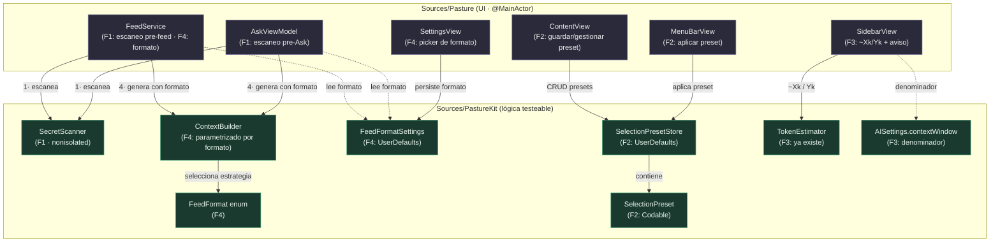
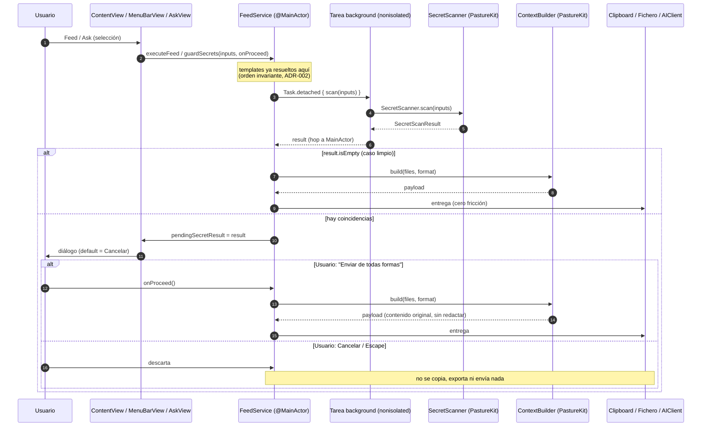
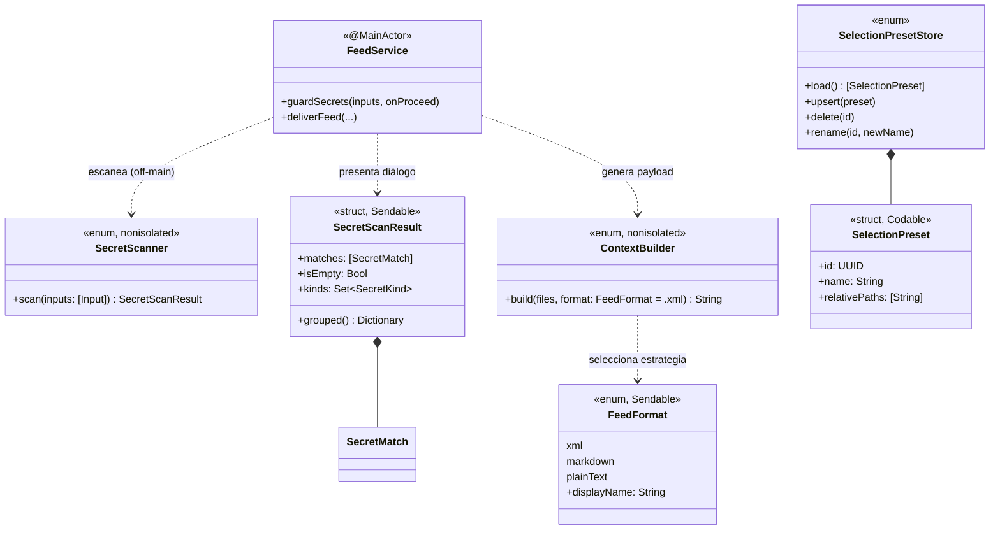

# Diseño técnico: Pasture v1.4 — Quick wins

**Versión objetivo:** 1.4.0
**Fecha:** 2026-06-12
**Autor:** El Dibujante de Cajas (architect, Alfred Dev)
**Estado:** PROPUESTO — pendiente de validación de seguridad + aprobación del usuario
**Input:** `docs/prd/v1.4-quick-wins.md` (APROBADO CON CONDICIONES)

---

## 0. Resumen ejecutivo

Cuatro features, una restricción dura (**cero dependencias nuevas**) y un invariante de oro: **la salida XML+CDATA de v1.3 debe quedar byte-idéntica como default** (riesgo de regresión alto, mitigado con snapshot test).

El diseño respeta el contrato de los dos targets: **toda lógica testeable vive en PastureKit**; `Sources/Pasture/` solo orquesta UI. Las cuatro features introducen cuatro tipos nuevos en PastureKit (`SecretScanner`, `FeedFormat`, `SelectionPreset`, `SelectionPresetStore`) y un namespace de settings (`FeedFormatSettings`), más enganches quirúrgicos en `FeedService`, `AskViewModel`, `SidebarView` y `MenuBarView`.

Principio rector: **una sola tubería de generación de feed**. Hoy `ContextBuilder.build(files:)` es el único punto de generación. v1.4 lo mantiene como único punto, parametrizado por formato, y antepone un único punto de escaneo de secretos. Si hay dos sitios donde se genera o se escanea, lo hemos hecho mal.

> Acoplamiento temporal. Lo huelo desde aquí: el escaneo de secretos *debe* ocurrir después de resolver templates y antes de entregar el feed. Ese orden es un invariante, no una casualidad. Lo documento abajo (ADR-002) y lo encierro en un solo método para que nadie lo reordene por accidente.

---

## 1. Visión de componentes (alto nivel)



**Leyenda:**
- **Flecha sólida** = dependencia de invocación directa (A llama a B).
- **Flecha punteada** = lectura de configuración (UserDefaults).
- **Cajas verdes** = PastureKit (testeable, sin UI).
- **Cajas grises** = capa UI (`@MainActor`, SwiftUI).
- Numeración `1·` / `4·` = a qué feature pertenece la arista.

Las dependencias van de **fuera (UI) hacia dentro (PastureKit)**. PastureKit no conoce a nadie de la UI. Invariante de arquitectura hexagonal: el dominio no depende de la infraestructura. No es negociable.

---

## 2. Diseño por feature

### F1 — SecretScanner (P0)

#### Responsabilidad

Una sola: **dado un conjunto de (nombre de fichero, contenido), devolver las coincidencias de patrones de secreto**. No decide políticas de UI, no bloquea, no redacta. Detecta y reporta. Si necesitara una "y" para describirla, sería dos componentes.

#### Target

**PastureKit** — 100% testeable, sin UI, `nonisolated`. Es el corazón de seguridad de la feature y debe tener cobertura exhaustiva (positivos y negativos del catálogo) antes de tocar una sola vista.

#### API pública propuesta

```swift
// Sources/PastureKit/SecretScanner.swift

/// Familia de secreto detectada. Driver del texto que ve el usuario en el aviso.
public enum SecretKind: String, Sendable, CaseIterable, Hashable {
    case anthropicKey       // sk-ant-...
    case openAIKey          // sk-... (genérico, excluyendo sk-ant)
    case githubToken        // ghp_ / gho_ / ghu_ / ghs_
    case awsAccessKey       // AKIA[0-9A-Z]{16}
    case pemPrivateKey      // -----BEGIN ... PRIVATE KEY-----

    /// Etiqueta legible para el aviso (ej: "clave Anthropic").
    public var displayName: String { /* mapeo fijo */ }
}

/// Una coincidencia concreta dentro de un fichero.
public struct SecretMatch: Sendable, Hashable, Identifiable {
    public let id: UUID
    public let kind: SecretKind
    public let fileName: String
    public let lineNumber: Int          // 1-based; para contexto en el aviso
    /// Fragmento ENMASCARADO para mostrar sin re-exponer el secreto en el diálogo.
    /// (ej: "sk-ant-…23ab"). Nunca el secreto completo.
    public let maskedSnippet: String
}

/// Resultado agregado de un escaneo. Vacío => no hay fricción.
public struct SecretScanResult: Sendable, Hashable {
    public let matches: [SecretMatch]
    public var isEmpty: Bool { matches.isEmpty }

    /// Agrupación para el diálogo: por fichero, luego por tipo.
    public func grouped() -> [String: [SecretKind: [SecretMatch]]]

    /// Tipos únicos detectados (para el resumen "clave Anthropic, token GitHub").
    public var kinds: Set<SecretKind> { Set(matches.map(\.kind)) }
}

public enum SecretScanner {
    /// Entrada del escaneo: el MISMO par (nombre, contenido) que alimenta ContextBuilder.
    public struct Input: Sendable {
        public let fileName: String
        public let content: String
        public init(fileName: String, content: String)
    }

    /// Escaneo síncrono puro. Determinista. Sin estado.
    /// Pensado para ejecutarse OFF the main actor en selecciones grandes.
    public static func scan(_ inputs: [Input]) -> SecretScanResult

    /// Conveniencia para un solo fichero (usada en tests).
    public static func scan(fileName: String, content: String) -> SecretScanResult
}
```

#### Decisiones de implementación (para el senior-dev, sin escribir el código)

- **Catálogo de patrones (ADR-001):** una tabla estática `[(SecretKind, Pattern)]` donde `Pattern` es un literal anclado o una `NSRegularExpression` precompilada **una sola vez** (`static let`). Nada de compilar regex por invocación.
  - `anthropicKey`: prefijo literal `sk-ant-` + cuerpo. Se evalúa **antes** que `openAIKey` para que `sk-ant-...` no caiga en el genérico `sk-`.
  - `openAIKey`: `sk-` seguido de ≥20 alfanuméricos, **negando** el prefijo `sk-ant-`.
  - `githubToken`: alternancia `gh[opus]_` + ≥20 alfanuméricos.
  - `awsAccessKey`: `AKIA[0-9A-Z]{16}` (límite de palabra para reducir falsos positivos).
  - `pemPrivateKey`: literal `-----BEGIN` … `PRIVATE KEY-----` (multilínea; basta detectar la cabecera `BEGIN`).
- **Enmascarado del snippet:** mostrar primeros 7 + `…` + últimos 4 caracteres. El secreto completo **nunca** sale del fichero hacia el diálogo (invariante de seguridad: el aviso no debe convertirse en otra fuga, p.ej. en una captura de pantalla).
- **`NSRegularExpression` vs `Regex` de Swift:** elegimos `NSRegularExpression` con patrones precompilados → ADR-001. Disponible desde macOS 10.0, rendimiento predecible, sin overhead de tipo en caliente.
- **Por qué patrones anclados y no entropía:** la detección por entropía (Shannon) dispara falsos positivos en hashes, UUIDs y base64 legítimo. El PRD pide un catálogo acotado, no un escáner genérico. YAGNI para entropía en v1.4.

#### Punto de enganche (UI)

El escaneo se invoca en **un único método compartido** antes de entregar cualquier feed. Hoy `FeedService.deliverFeed(...)` es el punto común de clipboard/export; `AskViewModel.send(...)` es el de Ask. Ambos pasan por la misma puerta:

```swift
// Sources/Pasture/FeedService.swift  (extensión, @MainActor)
extension FeedService {
    /// Escanea OFF the main actor, presenta el diálogo si hay coincidencias,
    /// y solo entonces ejecuta la continuación. Default seguro = Cancelar.
    func guardSecrets(
        inputs: [SecretScanner.Input],
        onProceed: @escaping @MainActor () -> Void
    )
}
```

Estado del diálogo en `FeedService` (`@Published var pendingSecretResult: SecretScanResult?` + `pendingSecretProceed: (() -> Void)?`). La vista presenta un `.sheet`/`.alert` cuando `pendingSecretResult != nil`. `AskView` enruta su escaneo por la **misma** instancia de `FeedService` que ya comparte con `ContentView` (ver CLAUDE.md: AskView ya recibe la FeedService de ContentView). Así el diálogo de secretos es uno solo, no tres copias.

> Separación de responsabilidades: `SecretScanner` (PastureKit) **detecta**. `FeedService` (UI) **decide la política** (avisar, default Cancelar, override). El catálogo no sabe nada de diálogos; la UI no sabe nada de regex.

---

### F2 — Presets de selección (P1)

#### Responsabilidad

`SelectionPreset` = un nombre + una lista de **paths relativos a `~/.pasture/`**. `SelectionPresetStore` = persistencia CRUD en UserDefaults. Ninguno conoce `MDFile` ni el filesystem real: un preset es una *referencia*, no una fuente de verdad (decisión de producto ratificada).

#### Target

**PastureKit** — modelo + store testeables. La resolución preset→`[MDFile]` (que sí toca filesystem vía `MDFileManager`) vive en la UI como función fina.

#### API pública propuesta

```swift
// Sources/PastureKit/SelectionPreset.swift

public struct SelectionPreset: Codable, Sendable, Hashable, Identifiable {
    public let id: UUID
    public var name: String
    /// Paths relativos a ~/.pasture/ (ej: "notes.md", "proyectoX/spec.md").
    /// NO se guarda contenido ni URL absoluta (ADR-003).
    public var relativePaths: [String]
    public var createdAt: Date

    public init(id: UUID = UUID(), name: String, relativePaths: [String], createdAt: Date = Date())
}

// Sources/PastureKit/SelectionPresetStore.swift
// Mismo patrón que ExportSettings/AISettings: namespace estático, UserDefaults, notificación.
public enum SelectionPresetStore {
    public static let didChangeNotification: Notification.Name

    public static func load(from defaults: UserDefaults = .standard) -> [SelectionPreset]
    public static func save(_ presets: [SelectionPreset], to defaults: UserDefaults = .standard)

    /// Inserta o sustituye por id. Dispara didChangeNotification.
    public static func upsert(_ preset: SelectionPreset, in defaults: UserDefaults = .standard)
    public static func delete(id: UUID, in defaults: UserDefaults = .standard)
    public static func rename(id: UUID, to newName: String, in defaults: UserDefaults = .standard)

    /// Busca por nombre (case-insensitive) para la confirmación de sobrescritura.
    public static func preset(named name: String, in defaults: UserDefaults = .standard) -> SelectionPreset?
}
```

#### Resolución preset → selección (UI, función fina)

La conversión de paths relativos a `MDFile` existentes vive junto a `MDFileManager` (es quien conoce `pastureDir` y `files`). No es lógica de dominio compleja: es un mapeo con filtro.

```swift
// Sources/Pasture/MDFileManager.swift (extensión, @MainActor)
extension MDFileManager {
    /// Devuelve los MDFile existentes para un preset + el nº de paths ausentes.
    func resolve(_ preset: SelectionPreset) -> (files: [MDFile], missingCount: Int)

    /// Construye los relativePaths de una selección actual (para "Guardar como preset").
    func relativePaths(for files: [MDFile]) -> [String]
}
```

- **Path relativo:** `file.url.path` con prefijo `pastureDir.path` recortado. Reutiliza la misma base que `PathValidator`. Estable frente a edición de contenido y a mover `~/.pasture/`.
- **Ficheros fantasma (HU-5):** `resolve` filtra por `fm.files`; `missingCount > 0` → la UI muestra un toast con el conteo vía `FeedService.showFeedback`. El preset **no se borra**. Aplica igual desde ventana y menu bar (cada superficie aplica a *su* selección independiente — contrato de v1.3 intacto).
- **Nombre duplicado (HU-4):** la UI consulta `preset(named:)` antes de `upsert`; si existe, alerta de confirmación de sobrescritura.

#### Enganche UI

- **Guardar / gestionar (ventana):** `ContentView` añade un control "Presets" (menú) con "Guardar selección como preset…", "Aplicar ▸ {lista}", "Renombrar / Eliminar". Reutiliza `NameInputSheet` (ya existe para rename de ficheros).
- **Aplicar (menu bar):** `MenuBarView` añade un menú "Presets" en el header o footer que, al elegir uno, hace `selectedFiles = Set(resolved.files)`.
- Ambas superficies escuchan `SelectionPresetStore.didChangeNotification` (mismo patrón que `ExportSettings`) para refrescar la lista.

---

### F3 — Aviso de límite de contexto en el feed (P2)

#### Responsabilidad

Extender `selectionSummary` de `SidebarView` para mostrar `~Xk / Yk tokens` con el denominador del modelo configurado, y un estado de aviso (color/icono) **al exceder**. Casi solo UI. Cero lógica nueva en PastureKit: el dato (`TokenEstimator.formatted`, `model.contextWindow`) ya existe.

#### Target

**Pasture (UI)** — modificación de `SidebarView.selectionSummary`. Reutiliza el patrón de color de `AskView.contextUsageColor` pero con la regla **binaria** que pide el PRD (no el gradiente 50/80% de Ask).

#### Diseño

```swift
// SidebarView.swift — lógica local de la vista (NO en PastureKit)
private var contextWindow: Int? {
    // nil si no hay modelo => sin denominador (sin regresión).
    AISettings.loadModelID(...) resuelto vía AIModel.resolve → model.contextWindow
    // Devuelve nil solo si no hay API key/modelo configurado.
}

private var exceedsContext: Bool {
    guard let window = contextWindow, window > 0 else { return false }
    return totalTokens > window     // binario: solo al EXCEDER (ADR-004)
}
```

- **Con modelo:** `"~15k / 200k tokens"`. Si `exceedsContext`, color `pastureError(colorScheme)` + icono `exclamationmark.triangle.fill`.
- **Sin modelo:** `"~Xk tokens"` a secas — comportamiento idéntico a v1.3 (sin regresión, HU-8 caso negativo).
- **Contraste:** los tokens de color usados (`pastureError`, `pastureTokenBadgeText`) ya cumplen WCAG AA en ambos esquemas (invariante del proyecto). No se introducen colores nuevos.
- **Detección de "hay modelo configurado":** se considera que hay denominador si existe API key para el provider activo. Se decide en la vista; si resulta más limpio, se expone un helper `AISettings.hasConfiguredModel()` en PastureKit (decisión menor, delegada al senior-dev en el bloque TDD-F3).

> El gradiente verde/ámbar/rojo de Ask **no** se reutiliza tal cual: el PRD pide aviso binario (cabe/no cabe), no un semáforo. Misma paleta, regla distinta. Documentado para que no se "armonicen" por error.

---

### F4 — Formatos de salida (P3, adelantado en orden)

#### Responsabilidad

`ContextBuilder` deja de generar **solo** XML y pasa a generar según un `FeedFormat` (XML / Markdown / plano). Es el refactor de mayor riesgo de regresión del release.

#### Target

**PastureKit** — `FeedFormat` (enum + estrategia de render) y `ContextBuilder` parametrizado. `FeedFormatSettings` (UserDefaults).

#### API pública propuesta

```swift
// Sources/PastureKit/FeedFormat.swift

/// Formato del PAYLOAD del feed. INDEPENDIENTE de ExportFileFormat (extensión de fichero).
/// (ADR-005: deslinde payload vs extensión)
public enum FeedFormat: String, Codable, CaseIterable, Sendable {
    case xml        // <context>…<![CDATA[…]]></context>  ← DEFAULT, byte-idéntico a v1.3
    case markdown   // ## filename\n```fence\n…\n```
    case plainText  // separadores simples

    public var displayName: String { /* "XML (CDATA)", "Markdown", "Plain text" */ }
}
```

```swift
// Sources/PastureKit/ContextBuilder.swift — firma extendida (retrocompatible)

public enum ContextBuilder {
    public struct FileEntry: Sendable { /* sin cambios: name, content */ }

    /// NUEVA firma. El default .xml garantiza retrocompatibilidad de llamadas existentes.
    public static func build(files: [FileEntry], format: FeedFormat = .xml) -> String

    // Las funciones de render por formato son internas (no API pública):
    //   buildXML(_:)        → idéntica a la implementación actual, intacta
    //   buildMarkdown(_:)   → ## name + fence dinámico
    //   buildPlainText(_:)  → name + separador
}
```

```swift
// Sources/PastureKit/FeedFormatSettings.swift — mismo patrón que ExportSettings
public enum FeedFormatSettings {
    public static let didChangeNotification: Notification.Name
    public static func feedFormat(from defaults: UserDefaults = .standard) -> FeedFormat   // default .xml
    public static func setFeedFormat(_ format: FeedFormat, in defaults: UserDefaults = .standard)
}
```

#### Reglas de render (para el senior-dev)

- **`buildXML` es la función actual movida sin tocar una coma.** El cuerpo de `contextTag` (escape de `]]>`, `xmlEscapedAttribute`, `<documents>` para multi-fichero) se preserva literal. El snapshot test compara contra un fixture capturado de v1.3 → **byte-idéntico** (ADR-006, mitiga el riesgo "alto" del PRD).
- **`buildMarkdown`:** por fichero, `## {name}\n{fence}\n{content}\n{fence}`. **Fence dinámico (CommonMark):** contar la secuencia más larga de backticks consecutivos en el contenido; el fence envolvente usa `max(3, longest+1)` backticks. Multi-fichero: separados por línea en blanco. Sin envoltorio `<documents>`.
- **`buildPlainText`:** por fichero, `{name}\n{separador}\n{content}`, ficheros separados por separador simple (ej. línea de guiones o doble salto). Sin XML, sin fences.

#### Integración con los puntos de feed

`MDFileManager.feedContext(...)` pasa a leer `FeedFormatSettings.feedFormat()` y reenviarlo a `ContextBuilder.build(files:format:)`. Como `FeedFormat` aplica a los **tres canales** (clipboard, export, Ask), `AskViewModel` también construye su contexto con el formato configurado (hoy Ask usa el mismo `fm.feedContext`/`ContextBuilder` indirectamente; se unifica para que respete el picker).

> **Deslinde crítico (hallazgo del librarian #1):** `FeedFormat` (payload) y `ExportFileFormat` (extensión `.md`/`.txt`) son **ortogonales** y conviven sin tocarse. Un usuario puede exportar payload XML a un fichero `.md`, o payload Markdown a `.txt`. Son dos settings, dos pickers, dos claves de UserDefaults. Mezclarlos sería acoplamiento gratuito → ADR-005.

---

## 3. Flujo de datos: feed con escaneo de secretos (F1 + F4)



**Leyenda:** `nonisolated` = ejecutado fuera del main actor (no congela UI). El diálogo solo aparece en la rama con coincidencias → cero fricción en el caso limpio (criterio HU-1). El contenido entregado tras override es el **original** (sin redactado, decisión de producto).

**Invariante de orden (ADR-002):** `resolver templates → escanear secretos → generar payload → entregar`. El escaneo va sobre el contenido **renderizado** (lo que de verdad sale), no el crudo con `{{VARS}}`. Un secreto inyectado por una variable de template debe detectarse.

---

## 4. Estrategia de concurrencia

| Componente | Aislamiento | Justificación |
|---|---|---|
| `SecretScanner` | **`nonisolated`** (enum estático puro) | Función determinista sin estado. Debe poder correr fuera del main actor para no congelar la UI en selecciones grandes. |
| `ContextBuilder` (+ `FeedFormat`) | **`nonisolated`** (ya lo es) | Generación pura. Sin cambios de aislamiento. |
| `SelectionPreset` / `SelectionPresetStore` | **`Sendable` / `nonisolated`** | Modelo de valor + UserDefaults. Sin actor. |
| `FeedFormatSettings` | **`nonisolated`** | Namespace estático, mismo patrón que `ExportSettings`. |
| `FeedService` (enganche F1/F4) | **`@MainActor`** (ya lo es) | Orquesta UI y diálogos. |
| `AskViewModel` (enganche F1/F4) | **`@MainActor`** (ya lo es) | Igual. |
| `SidebarView` (F3) | **`@MainActor`** (View) | Solo lectura de settings + render. |

**El escaneo NO debe congelar la UI.** Patrón:

```swift
// En FeedService (@MainActor). El escaneo cruza al background y vuelve.
func guardSecrets(inputs: [SecretScanner.Input], onProceed: @escaping @MainActor () -> Void) {
    Task {
        // SecretScanner.scan es nonisolated y Sendable-safe → corre off-main.
        let result = await Task.detached(priority: .userInitiated) {
            SecretScanner.scan(inputs)   // CPU-bound, sin tocar el main actor
        }.value
        // de vuelta en MainActor por el contexto del Task en una clase @MainActor
        if result.isEmpty { onProceed() }
        else { presentSecretDialog(result, proceed: onProceed) }
    }
}
```

- `SecretScanner.Input` y `SecretScanResult` son `Sendable` → cruzan el límite del actor sin warnings de Swift 6 strict concurrency.
- Selección típica = unos pocos ficheros pequeños → el escaneo será sub-milisegundo. El `Task.detached` es la **red de seguridad** para el outlier (usuario que selecciona 100 ficheros grandes). Honesto: medible, no especulativo.
- **Coste:** un hop al background añade latencia imperceptible al caso limpio. Aceptable: el caso limpio no muestra diálogo, así que el usuario no percibe el hop. Trade-off documentado en §7.

---

## 5. Contratos entre componentes



**Leyenda:** `..>` = dependencia de uso; `*--` = composición (contiene). Estereotipos entre `<< >>` marcan tipo Swift + aislamiento. Los contratos (firmas públicas) se fijan **antes** de implementar: el senior-dev puede escribir tests contra estas firmas en paralelo.

---

## 6. Orden de implementación recomendado (bloques TDD)

Sigo el orden del PRD §11 con una matización (justificada). Cada bloque = tests primero, luego hacerlos pasar.

**Bloque 1 — F1 SecretScanner (núcleo, sin UI)** · *P0, máximo valor de seguridad*
1. Tests del catálogo: un positivo por familia (`sk-ant-`, `ghp_`, `AKIA…`, PEM, `sk-` genérico) + negativos clave (`sk-ant` no cae en genérico; UUID/hash/base64 no disparan; ejemplo de docs marcado como positivo es aceptable).
2. Tests de `grouped()` (multi-fichero, multi-tipo) y de `maskedSnippet` (no expone el secreto completo).
3. Implementar `SecretScanner` + tipos hasta verde.
   *Gate del bloque: 0 falsos negativos sobre el set del catálogo (métrica del PRD).*

**Bloque 2 — F4 Formatos (refactor de ContextBuilder)** · *adelantado: toca el mismo núcleo que F1 escanea*
4. **Snapshot test XML primero:** capturar la salida de v1.3 para 1 fichero y N ficheros como fixture; aserción de igualdad byte a byte contra `build(files:format:.xml)`. *Este test debe pasar ANTES de añadir Markdown/plano.*
5. Tests Markdown: fence dinámico con contenido que incluye ` ``` ` (fence de 4+ backticks); multi-fichero.
6. Tests plano: separador simple, sin XML/fences.
7. Extraer `buildXML` (intacto), añadir `buildMarkdown`/`buildPlainText`, parametrizar `build`. `FeedFormatSettings` + tests de persistencia.
   *Gate del bloque: snapshot XML verde = 0 regresiones.*

**Bloque 3 — F1 + F4 enganche en feed/Ask (UI)**
8. Conectar `guardSecrets` en `FeedService.deliverFeed` y en `AskViewModel.send` (escaneo previo a abrir red). Diálogo con default Cancelar.
9. `MDFileManager.feedContext` y el contexto de Ask leen `FeedFormatSettings`. Picker de formato en `SettingsView` (junto al de `ExportFileFormat`, sin mezclarlos).

**Bloque 4 — F3 Aviso de límite (UI, bajo riesgo)**
10. `SidebarView.selectionSummary`: denominador `~Xk / Yk` con modelo; sin modelo, sin regresión. Aviso binario al exceder.

**Bloque 5 — F2 Presets (mayor superficie de UI)** · *P1 en valor, último por coste/piezas*
11. Tests de `SelectionPreset` (Codable round-trip) y `SelectionPresetStore` (upsert/delete/rename/named).
12. `MDFileManager.resolve(_:)`/`relativePaths(for:)` + tests de ficheros fantasma (missingCount).
13. UI: guardar/gestionar en `ContentView`, aplicar en `MenuBarView`, toast de ausentes, confirmación de sobrescritura.

> Por qué F1→F4→…→F2 y no por prioridad de valor: F4 toca `ContextBuilder`, el mismo punto que F1 escanea y que todo feed atraviesa. Refactorizar ese núcleo **una vez**, con snapshot de protección, evita retrabajo y reduce la ventana de regresión. F2 es P1 en valor pero su superficie (ventana + menu bar + gestión) lo hace el bloque más caro → al final, cuando el núcleo está estable.

---

## 7. Riesgos y trade-offs

| Riesgo | Severidad | Mitigación de diseño |
|---|---|---|
| **Regresión del formato XML** al parametrizar `ContextBuilder` | **Alta** | `buildXML` = función actual movida sin tocar; snapshot test byte-idéntico como gate del Bloque 2 (ADR-006). |
| **Falsos negativos** del SecretScanner (secreto no detectado pasa) | Alta (seguridad) | Documentar como red *best-effort*, no garantía (PRD). Catálogo cubre familias comunes del flujo dev. Test con set conocido. No se vende como infalible. |
| **Falsos positivos** generan fricción → "ignorar siempre" | Media | Default Cancelar + override **por feed** (no un "desactivar para siempre" fácil). Catálogo específico, no agresivo (sin entropía). |
| **Colisión de fences** en Markdown rompe el contenido | Media | Fence dinámico CommonMark (`longest+1`). Test con backticks en el contenido. |
| **`FeedFormat` vs `ExportFileFormat`** se confunden/acoplan | Media | Deslinde explícito (ADR-005): dos enums, dos pickers, dos claves UserDefaults. Ortogonales. |
| **El hop a background** añade latencia al feed | Baja | Imperceptible (escaneo sub-ms en caso típico); el caso limpio no muestra diálogo. `Task.detached` es red para el outlier. Trade-off aceptado. |
| **Presets fantasma** confunden | Baja | Degradar con gracia + toast de conteo; sin borrado automático (PRD). |
| **El snippet enmascarado** podría re-exponer el secreto | Media | Mostrar solo 7+`…`+4 chars; nunca el secreto completo en el diálogo. Invariante de seguridad. |

**Trade-offs aceptados conscientemente:**
- **Patrones fijos, no configurables** (PRD fuera de alcance): deuda técnica menor y aditiva. Ampliar el catálogo en v1.5 no rompe nada.
- **Escaneo en el feed, no continuo:** coherente con "Pasture no edita inline". Menos cobertura, menos coste, sin ruido continuo.
- **Sin redactado:** se entrega el contenido original tras override. Más honesto que mutar silenciosamente el contexto.

---

## 8. Decisiones de arquitectura (ADRs)

> Estos ADRs se materializarán en `docs/adr/` (ADR-001…ADR-006) tras la aprobación. Aquí van en forma compacta para la revisión de la gate. Son inmutables una vez aceptados.

- **ADR-001 — `NSRegularExpression` precompilada para el catálogo de secretos.** *Alternativas:* `Regex` de Swift (macro `#/…/#`) vs literales puros vs entropía. *Decisión:* `NSRegularExpression` `static let` (compilada una vez) + literales anclados; entropía descartada (falsos positivos en hash/UUID/base64). *Consecuencia:* rendimiento predecible, sin dependencias; coste de mantener patrones a mano (aceptable, catálogo pequeño).
- **ADR-002 — Orden invariante del pipeline de feed.** *Decisión:* `templates → escaneo → generación → entrega`, encerrado en métodos que impiden reordenar. *Consecuencia:* se escanea el contenido realmente entregado (renderizado); un secreto inyectado por variable se detecta.
- **ADR-003 — Presets por path relativo, no por contenido ni URL absoluta.** *Alternativas:* guardar contenido (duplica estado, se desincroniza) vs URL absoluta (rompe si se mueve `~/.pasture/`). *Decisión:* path relativo a `pastureDir`. *Consecuencia:* estable ante edición y reubicación; resolución filtra ausentes.
- **ADR-004 — Aviso de límite binario (cabe/no cabe), no gradiente.** *Alternativas:* reutilizar el semáforo 50/80% de Ask vs umbral 90%. *Decisión:* binario al exceder. *Consecuencia:* honesto sobre la naturaleza heurística del estimador; misma paleta que Ask, regla distinta (no se "armoniza").
- **ADR-005 — Deslinde `FeedFormat` (payload) ⟂ `ExportFileFormat` (extensión).** *Decisión:* dos settings ortogonales independientes. *Consecuencia:* sin acoplamiento; combinables libremente; resuelve el hallazgo #1 del librarian.
- **ADR-006 — `ContextBuilder.build` retrocompatible con default `.xml` + snapshot byte-idéntico.** *Decisión:* nueva firma con parámetro `format: FeedFormat = .xml`; `buildXML` = código v1.3 intacto; snapshot como gate. *Consecuencia:* cero regresión garantizada por test; llamadas existentes compilan sin cambios.

---

## 9. Escalabilidad (qué pasa con 10x)

- **10x ficheros / ficheros 10x más grandes:** el escaneo es CPU-bound y `nonisolated` → ya está fuera del main actor. El cuello sería la lectura de contenido (ya en memoria vía `MDFile.content`). Sin cambios de diseño necesarios; el `Task.detached` absorbe el outlier.
- **10x presets:** UserDefaults serializa `[SelectionPreset]` como JSON; a cientos de presets sigue siendo trivial (KB). Si algún día son miles → migrar a fichero propio, pero **YAGNI** (PRD: sin ficheros de config propios).
- **10x patrones de secreto:** la tabla de regex precompiladas escala linealmente; cada patrón es un `static let`. Añadir familias es aditivo, sin recompilar en caliente.

---

## 10. Gate de aprobación del diseño

---
**VEREDICTO: APROBADO CON CONDICIONES**

**Resumen:** Diseño completo para v1.4: cuatro features ancladas en los puntos de integración verificados (ContextBuilder, FeedService, AskViewModel, SidebarView, MenuBarView), con toda la lógica testeable en PastureKit y cero dependencias nuevas. Resuelve los tres hallazgos del librarian (deslinde payload/extensión, reutilización del indicador de tokens, presets en UserDefaults).

**Hallazgos bloqueantes:** ninguno.

**Condiciones pendientes:**
1. **Validación del security-officer** sobre: catálogo de patrones, enmascarado del snippet, orden invariante del pipeline (ADR-002), y que el override no introduzca un bypass del escaneo en ningún canal.
2. **Aprobación del usuario** del enfoque (en especial ADR-005 deslinde de formatos y ADR-006 estrategia de snapshot para el XML).

**Próxima acción recomendada:** El security-officer revisa el threat model del SecretScanner y el flujo de override. En paralelo, el usuario ratifica el enfoque. Con ambas, la gate pasa a APROBADO y se materializan los ADR-001…006 en `docs/adr/` antes de entregar al senior-dev.

---
