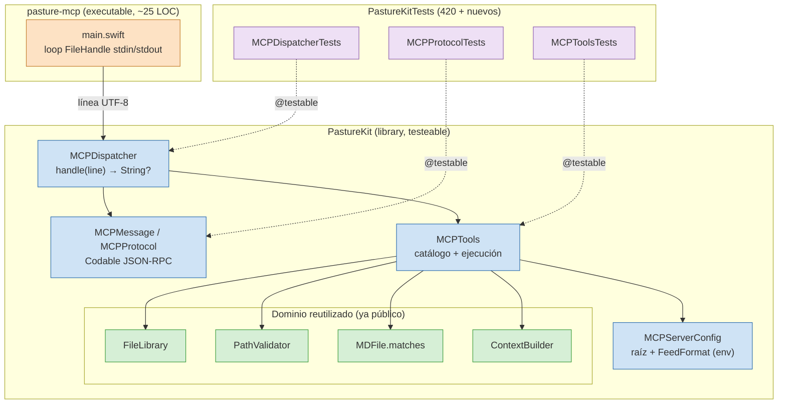
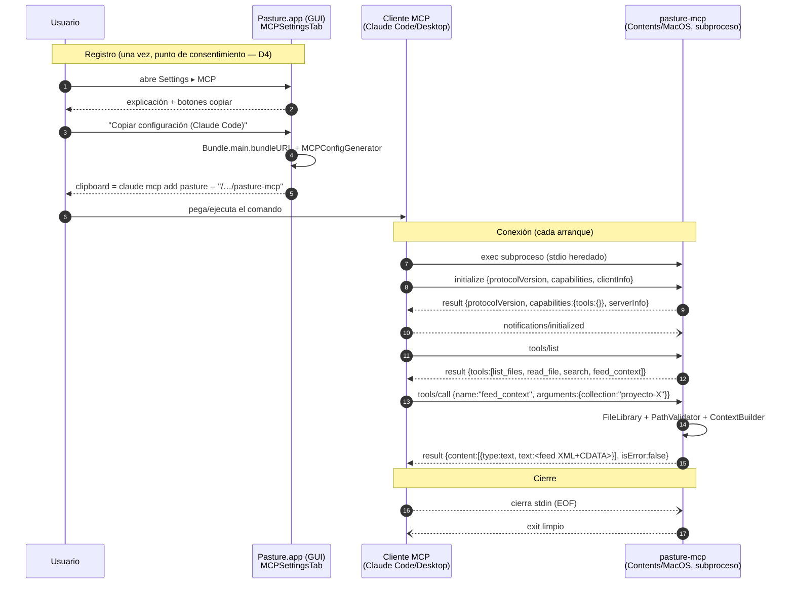

# Diseño de implementación: v1.5 — Servidor MCP `pasture-mcp`

- **Estado:** Propuesto — pendiente de validación de seguridad (security-officer) y aprobación del usuario.
- **Fecha:** 2026-06-12.
- **Tipo:** Fase 2 (Arquitectura) de `/alfred feature`.
- **Autor:** El Dibujante de Cajas (architect).
- **Inputs:** `docs/spikes/spike-mcp-server.md` (PoC + ADR-001/002/003) · `docs/prd/v1.5-mcp-server.md` (10 historias, D1-D6) · código real de PastureKit.
- **Versión spec MCP:** `2025-06-18`.
- **Entregable de:** este documento + ADRs → guía de implementación para el senior-dev.

> Este diseño es la **implementación definitiva**, no un spike. Promueve ADR-001/002/003 de
> *Propuesto* a *Aceptado* (R1 Gatekeeper despejado, ver §0) y añade ADR-004…ADR-007 que mi
> diseño genera. Vive dentro del marco del spike y del PRD; no los reabre.

---

## 0. Resumen ejecutivo y cambios respecto al spike

El spike dejó tres riesgos que este diseño cierra o convierte en requisitos:

- **R1 (Gatekeeper) — DESPEJADO empíricamente.** El exec de `pasture-mcp` por un cliente MCP
  no dispara el assessment de Gatekeeper; el binario embebido conecta incluso con quarantine.
  ADR-002 pasa a **Aceptado sin matices**. No hay que firmar ni notarizar el `.app` en v1.5.
- **R3 (firma de seguridad) — en curso:** este documento es el input del security-officer.
- **R5 (`search` sin límites) — cerrado por D1 del PRD:** búsqueda literal vía `MDFile.matches`,
  ReDoS imposible por diseño.

Decisiones nuevas que introduce este diseño (formalizadas como ADRs):

| ADR | Decisión | Resumen |
|---|---|---|
| **ADR-004** | **Capa de protocolo en PastureKit**, no en el executable. | Máxima testeabilidad con los 420 tests como vecinos; el executable queda como un `main.swift` fino. |
| **ADR-005** | **Loop secuencial síncrono, sin actor ni async.** | El server es single-threaded por contrato MCP-stdio; introducir concurrencia sería complejidad sin problema que resolver. |
| **ADR-006** | **`feed_context` única** (refrenda D2 del PRD) y **`JSONEncoder` con `.withoutEscapingSlashes` + `.sortedKeys`**. | Una tool para un verbo; output limpio; corrige el gotcha 7 del spike con un dato empírico. |
| **ADR-007** | **`pasture-mcp` lee su configuración del entorno, no de `UserDefaults.standard`.** | Un proceso CLI separado NO comparte el dominio de defaults de la app GUI; el formato de feed se resuelve por variable de entorno con default `.xml`. |

**Hallazgo empírico que corrige el spike (gotcha 7):** verifiqué con un micro-programa Swift que
`JSONEncoder` **sí** escapa los `\n` embebidos del contenido como `\n` literal (una línea = un
mensaje, framing a salvo), **pero también escapa `/` como `\/` por defecto, igual que
`JSONSerialization`**. El spike afirmaba que migrar a `Codable` daba "output limpio"; es cierto
solo si además se activa `outputFormatting = .withoutEscapingSlashes`. Sin esa opción,
`Codable` y `JSONSerialization` producen el mismo `\/`. Esto es un requisito de diseño, no un
detalle (ADR-006).

---

## 1. Layout de targets

### Decisión: capa de protocolo en PastureKit (ADR-004)

El criterio del encargo es **máxima testeabilidad con mínima superficie pública nueva**. Hay
dos sitios donde puede vivir la capa de protocolo (tipos JSON-RPC, framing, dispatcher, tools):

- **A) En el executable `pasture-mcp`**, con un **quinto target de tests** que dependa del
  executable. Problema: testear símbolos de un `executableTarget` exige `@testable import` de un
  ejecutable, lo que arrastra el `main` y la entrada del proceso; es frágil y el equipo no lo
  hace en ningún sitio. Y duplica infraestructura de tests.
- **B) En `PastureKit`** (un nuevo sub-namespace `MCP`), con el executable reducido a un
  `main.swift` fino que solo cablea stdin/stdout al dispatcher. Los **420 tests existentes** son
  vecinos directos: `MCPDispatcherTests`, `MCPProtocolTests`, `MCPToolsTests` viven en
  `Tests/PastureKitTests/` junto a `ContextBuilderTests`, `PathValidatorTests`, etc., con el
  mismo `@testable import PastureKit`.

**Gana B (ADR-004).** Toda la lógica testeable (parseo de líneas, dispatch, tools, serialización)
es Swift puro sin I/O de proceso, idéntica en naturaleza a `SSEParser`, `ContextBuilder` o
`PathValidator`, que ya viven en PastureKit. El executable no contiene lógica: solo el loop de
transporte real (`FileHandle`/`readLine`). Esto reduce la superficie pública nueva a un puñado de
tipos `MCP*` en PastureKit y deja el `main.swift` por debajo de las ~30 líneas.

### Package.swift resultante (cuarto target)

```swift
// swift-tools-version: 6.0
import PackageDescription

let package = Package(
    name: "Pasture",
    platforms: [.macOS(.v14)],
    targets: [
        .target(name: "PastureKit", path: "Sources/PastureKit"),
        .executableTarget(
            name: "Pasture",
            dependencies: ["PastureKit"],
            path: "Sources/Pasture"
        ),
        // NUEVO: cuarto target executable. main.swift fino + cero deps externas.
        .executableTarget(
            name: "pasture-mcp",
            dependencies: ["PastureKit"],
            path: "Sources/pasture-mcp"
        ),
        .testTarget(
            name: "PastureKitTests",
            dependencies: ["PastureKit"],
            path: "Tests/PastureKitTests"   // los tests MCP viven aquí (ADR-004)
        )
    ]
)
```

- **Cero `.package`** — invariante cero-dependencias preservado (ADR-001).
- **Sin quinto target de tests.** La capa MCP se testea desde `PastureKitTests` (ADR-004).
- `Sources/pasture-mcp/main.swift` es lo único nuevo en el árbol de fuentes del executable.

### Estructura de ficheros nuevos en PastureKit

```
Sources/PastureKit/MCP/
├── MCPMessage.swift       // structs Codable JSON-RPC (request/response/error/id)
├── MCPProtocol.swift      // constantes: versión spec, capabilities, serverInfo, error codes
├── MCPDispatcher.swift    // handle(line:) -> String? — la función pura testeable
├── MCPTools.swift         // catálogo (inputSchema) + ejecución de cada tool
└── MCPServerConfig.swift  // raíz del vault + FeedFormat desde entorno (ADR-007)

Sources/pasture-mcp/
└── main.swift             // ~25 líneas: loop stdin → MCPDispatcher → stdout

Tests/PastureKitTests/
├── MCPProtocolTests.swift     // parseo de id string|number, notificaciones, errores
├── MCPDispatcherTests.swift   // initialize/initialized/ping/tools-list/tools-call
└── MCPToolsTests.swift        // las 4 tools + golden feed_context + traversal + vacíos
```



*Leyenda: cajas naranjas = executable (I/O de proceso, no testeable); azules = capa MCP nueva en
PastureKit; verdes = dominio ya existente y público; moradas = tests. Flechas sólidas = llamada
en runtime; flechas discontinuas = `@testable import` en tests. La frontera testeable es la línea
entre `main.swift` y `MCPDispatcher`: todo lo de la derecha se testea sin arrancar un proceso.*

---

## 2. API propuesta (signatures Swift)

> Todas las signatures están ancladas en el código real verificado: `ContextBuilder.FileEntry`
> recibe `name` SIN extensión y le añade `.md`; `MDFile.matches(query:)` es case-insensitive
> sobre nombre y contenido; `MDFile.collection(relativeTo:)` da el nombre de la colección;
> `FileLibrary.load(at:)` es `async` y devuelve `LoadResult`; `PathValidator.isInside(target:base:)`
> es el gate. La capa MCP **no reimplementa** nada de esto.

### 2.1 Tipos JSON-RPC Codable (`MCPMessage.swift`)

El punto delicado es el `id`: en JSON-RPC 2.0 puede ser **string o number** (o ausente en
notificaciones). Un `enum` con `Codable` manual lo resuelve sin perder el tipo de origen para
ecoarlo idéntico en la respuesta.

```swift
import Foundation

/// id de JSON-RPC 2.0: puede ser string, number o estar ausente (notificación).
/// Se ecoa idéntico en la respuesta. Sendable para Swift 6.
public enum JSONRPCID: Codable, Equatable, Sendable {
    case string(String)
    case number(Int)

    public init(from decoder: Decoder) throws {
        let c = try decoder.singleValueContainer()
        if let s = try? c.decode(String.self) { self = .string(s); return }
        if let n = try? c.decode(Int.self) { self = .number(n); return }
        throw DecodingError.dataCorruptedError(
            in: c, debugDescription: "id no es string ni number")
    }

    public func encode(to encoder: Encoder) throws {
        var c = encoder.singleValueContainer()
        switch self {
        case .string(let s): try c.encode(s)
        case .number(let n): try c.encode(n)
        }
    }
}

/// Request o notificación entrante. La ausencia de `id` la marca como notificación (gotcha 5).
/// `params` se mantiene como contenedor decodificable bajo demanda por cada handler,
/// no como `[String: Any]` (que no es Codable ni Sendable).
public struct JSONRPCRequest: Decodable, Sendable {
    public let jsonrpc: String          // "2.0"
    public let id: JSONRPCID?           // nil ⇒ notificación
    public let method: String
    public let params: JSONValue?       // decodificado por tipo en cada tool

    public var isNotification: Bool { id == nil }
}

/// Respuesta de éxito. `result` es genérico por método (Encodable).
public struct JSONRPCResponse<R: Encodable>: Encodable {
    public let jsonrpc = "2.0"
    public let id: JSONRPCID
    public let result: R
}

/// Respuesta de ERROR DE PROTOCOLO (objeto `error` JSON-RPC). NO confundir con isError de tool.
public struct JSONRPCErrorResponse: Encodable {
    public struct ErrorBody: Encodable {
        public let code: Int
        public let message: String
    }
    public let jsonrpc = "2.0"
    public let id: JSONRPCID?            // puede ser null (parse error sin id correlacionable)
    public let error: ErrorBody
}
```

**`JSONValue`** es un enum `Codable` mínimo (`object`/`array`/`string`/`number`/`bool`/`null`)
para representar `params` y `arguments` sin recurrir a `[String: Any]` (que rompe `Sendable` y
`Codable` en Swift 6). Es ~40 líneas, autónomo, testeable, cero dependencias. Cada tool extrae
sus campos tipados (`params.object?["collection"]?.stringValue`) en vez de castear `Any`.

### 2.2 Capacidades y serverInfo (`MCPProtocol.swift`)

```swift
public enum MCPProtocol {
    public static let version = "2025-06-18"
    public static let serverName = "pasture-mcp"
    public static let serverVersion = "1.5.0"

    // Error codes JSON-RPC (errores de PROTOCOLO, no de tool — ver D6/ADR-006).
    public static let parseError = -32700
    public static let invalidRequest = -32600
    public static let methodNotFound = -32601
    public static let invalidParams = -32602
}

/// Respuesta de initialize. capabilities.tools DEBE estar presente aunque vacío (gotcha 3).
public struct InitializeResult: Encodable {
    public struct Capabilities: Encodable {
        public let tools: [String: String]   // {} serializado — presente y vacío
    }
    public struct ServerInfo: Encodable {
        public let name: String
        public let version: String
    }
    public let protocolVersion: String
    public let capabilities: Capabilities
    public let serverInfo: ServerInfo
}
```

### 2.3 Resultado de tool (`isError` en `result`, gotcha 6 / D6)

```swift
/// Resultado de tools/call. isError:true = fallo de TOOL (lo ve el modelo, se recupera).
/// Distinto del objeto `error` JSON-RPC (fallo de PROTOCOLO). No confundirlos (ADR-006).
public struct ToolCallResult: Encodable {
    public struct TextContent: Encodable {
        public let type = "text"
        public let text: String
    }
    public let content: [TextContent]
    public let isError: Bool

    public static func ok(_ text: String) -> ToolCallResult {
        ToolCallResult(content: [TextContent(text: text)], isError: false)
    }
    public static func failure(_ text: String) -> ToolCallResult {
        ToolCallResult(content: [TextContent(text: text)], isError: true)
    }
}
```

### 2.4 El dispatcher — frontera testeable (`MCPDispatcher.swift`)

La clave de la testeabilidad (ADR-004) es separar **transporte** (stdin/stdout real, en el
executable) de **lógica** (línea de entrada → línea de salida, función pura en PastureKit).

```swift
/// Núcleo testeable: una línea JSON-RPC entrante → una línea de respuesta (o nil si
/// es notificación, que no se responde). SIN I/O de proceso: el executable la cablea
/// a FileHandle. Esto es lo que prueban MCPDispatcherTests sin arrancar un subproceso.
public struct MCPDispatcher: Sendable {
    private let config: MCPServerConfig

    public init(config: MCPServerConfig) { self.config = config }

    /// nil ⇒ no emitir nada (notificación o línea vacía). Nunca lanza: todo fallo
    /// se traduce en una línea de error JSON-RPC o en isError de tool.
    public func handle(line: String) -> String? {
        // 1. Decodificar. Fallo ⇒ -32700 con id null (gotcha: parse error).
        // 2. Si isNotification ⇒ procesar efecto (none) y devolver nil (gotcha 5).
        // 3. switch method:
        //    "initialize"               → InitializeResult (capabilities.tools presente)
        //    "notifications/initialized"→ nil  (no-op, es notificación)
        //    "ping"                     → result {}
        //    "tools/list"               → MCPTools.catalog
        //    "tools/call"               → MCPTools.run(...) → ToolCallResult
        //    desconocido                → -32601 methodNotFound
    }
}
```

El **executable** (`Sources/pasture-mcp/main.swift`) es entonces trivial y es lo ÚNICO que toca
I/O de proceso:

```swift
import Foundation
import PastureKit

// stderr para logs; stdout SAGRADO solo para mensajes MCP (gotcha 1-2, ADR-006).
func log(_ m: String) { FileHandle.standardError.write(Data("[pasture-mcp] \(m)\n".utf8)) }

let dispatcher = MCPDispatcher(config: .fromEnvironment())   // ADR-007
log("ready, reading stdin…")
while let line = readLine(strippingNewline: true) {
    if line.isEmpty { continue }
    if let response = dispatcher.handle(line: line) {
        FileHandle.standardOutput.write(Data(response.utf8))
        FileHandle.standardOutput.write(Data("\n".utf8))     // framing newline (gotcha 7)
    }
}
log("stdin closed, exiting.")   // EOF ⇒ salida limpia (no hay shutdown MCP)
```

### 2.5 Serialización limpia (`MCPProtocol` helper — corrige gotcha 7)

```swift
extension Encodable {
    /// Serializa a UNA línea sin newlines de pretty-print, claves ordenadas
    /// (golden tests deterministas) y SIN escapar `/` (corrige el \/ que el spike
    /// atribuyó solo a JSONSerialization — JSONEncoder lo hace igual por defecto).
    func mcpLine() throws -> String {
        let enc = JSONEncoder()
        enc.outputFormatting = [.sortedKeys, .withoutEscapingSlashes]
        let data = try enc.encode(self)
        return String(decoding: data, as: UTF8.self)
    }
}
```

### 2.6 Contrato de cada tool (`MCPTools.swift`) — inputSchema + mapeo a dominio

Cuatro tools (D2 fusionó `get_context`+`feed_context` en una sola → cuatro, no cinco).

```swift
public enum MCPTools {

    /// Catálogo para tools/list. Cada inputSchema tiene type:"object" (gotcha 4).
    public static func catalog() -> ToolsListResult { /* … structs Encodable … */ }

    /// Despacho por nombre. Devuelve ToolCallResult (isError de tool, nunca lanza
    /// hacia el protocolo). Tool desconocido en tools/call ⇒ isError:true (no -32601:
    /// un nombre de tool inválido es error de tool, no de protocolo).
    public static func run(name: String, arguments: JSONValue?, config: MCPServerConfig) -> ToolCallResult
}
```

| Tool | inputSchema (JSON) | Mapeo a dominio | Errores de tool (`isError:true`) |
|---|---|---|---|
| `list_files` | `{type:object, properties:{}, required:[]}` | `FileLibrary.load(at: vault)` → para cada `MDFile`, `file.collection(relativeTo: vault)` + ruta relativa. Vault vacío ⇒ lista vacía con éxito (HU-8). | (ninguno — un vault vacío es éxito) |
| `read_file` | `{type:object, properties:{path:{type:string}}, required:[path]}` | `vault.appendingPathComponent(path)` → `PathValidator.isInside(target:base:vault)` ANTES de I/O → `String(contentsOf:)`. | path fuera del vault ("ruta fuera del vault"); inexistente ("fichero no encontrado"); `path` ausente/vacío. |
| `search` | `{type:object, properties:{query:{type:string}}, required:[query]}` | `FileLibrary.load(at: vault)` → `files.filter { $0.matches(query:) }` (literal, case-insensitive, D1). Query vacía ⇒ `matches` devuelve todo; se acota a lista vacía para no volcar el vault (HU-10, ver nota). | (ninguno) |
| `feed_context` | `{type:object, properties:{collection:{type:string}, files:{type:array,items:{type:string}}}, required:[]}` | Ver §2.7. Reutiliza `ContextBuilder.build(files:format:)` con el `FeedFormat` de `config` (ADR-007). | colección inexistente; sin `collection` ni `files` (HU-7); todos los ficheros ausentes. |

**Nota sobre `search` y query vacía:** `MDFile.matches` devuelve `true` para query vacía (en la
app, "sin filtro" = todo). En el canal MCP eso volcaría el vault entero como "match", lo que el
PRD (HU-10) prohíbe. El diseño **intercepta la query vacía en la tool** y devuelve lista vacía con
éxito, ANTES de llamar a `matches`. No se modifica `MDFile.matches` (invariante compartido con la
app). Es una decisión de la capa de tool, documentada y testeada.

### 2.7 `feed_context`: contrato detallado (tool estrella, D2/D3)

```swift
// Pseudo-contrato (la implementación es del senior-dev):
// 1. Leer arguments: collection?: String, files?: [String].
// 2. Si ambos ausentes/vacíos ⇒ failure("se requiere 'collection' o 'files'"). (HU-7)
// 3. Selección de URLs:
//    - Si 'files' presente: para cada nombre, vault/<name>, PathValidator gate por cada uno.
//      Los ausentes se OMITEN del ensamblado y se listan como aviso (HU-7: no falla en bloque).
//      Si 'files' Y 'collection' presentes ⇒ gana 'files' (más específico, D2).
//    - Si solo 'collection': resolver vault/<collection>/ ; si no es subdir real
//      (FileLibrary.realSubdirectories) ⇒ failure("colección no encontrada"). (HU-6)
//      FileLibrary.mdFiles(in: collectionDir) da los .md, symlinks ya filtrados.
// 4. Construir [ContextBuilder.FileEntry(name: <SIN .md>, content: <crudo, D3>)]
//    en el ORDEN pedido (HU-7).  ⚠ name sin extensión: ContextBuilder añade ".md".
// 5. ContextBuilder.build(files: entries, format: config.feedFormat)  → result text.
//    Templates CRUDOS (D3): NO se llama a TemplateEngine.render. Los {{VAR}} van tal cual.
//    El escape de "]]>" lo hace ContextBuilder (HU-6, CDATA injection cubierta).
// 6. ok(payload).
```

**Golden test obligatorio (métrica del PRD):** la salida de `feed_context` para una selección
debe ser **estructuralmente idéntica** al Feed que la app produce para esa misma selección, porque
ambos pasan por exactamente el mismo `ContextBuilder.build(files:format:)`. El test golden compara
ambas salidas. Esto es lo que garantiza que el server "no es una carpeta más".

---

## 3. Los 7 gotchas del PoC como requisitos de diseño

| # | Gotcha | Cómo lo aborda el diseño |
|---|---|---|
| 1 | **stdout sagrado** | El único `write` a `FileHandle.standardOutput` está en `main.swift`, y solo con líneas que vienen de `dispatcher.handle()`. Ningún `print()` en todo el target. **Requisito de no-regresión** (riesgo del PRD). |
| 2 | **Logging a stderr** | `log()` escribe a `FileHandle.standardError` exclusivamente. La capa PastureKit **no loguea** (es pura); solo el executable. |
| 3 | **capabilities.tools presente** | `InitializeResult.Capabilities.tools: [String:String]` se serializa como `{}` presente, nunca ausente. Test explícito en `MCPDispatcherTests`. |
| 4 | **inputSchema type:object** | Cada entrada de `catalog()` tiene `inputSchema` con `type:"object"`, incluso `list_files` con `properties:{}`. Test que recorre el catálogo y asegura el invariante. |
| 5 | **Notificaciones por ausencia de id** | `JSONRPCRequest.isNotification == (id == nil)`. `handle(line:)` devuelve `nil` para notificaciones → el executable no emite nada. `notifications/initialized` es no-op. |
| 6 | **isError en result vs error JSON-RPC** | Dos tipos distintos: `ToolCallResult.isError` (fallo de tool, recuperable) vs `JSONRPCErrorResponse.error` (fallo de protocolo: parse, método, params). D6 lo fija; el código los separa por tipo, no por convención. |
| 7 | **Framing newline + JSONEncoder, no JSONSerialization** | `mcpLine()` usa `JSONEncoder`. **Verificado empíricamente:** `JSONEncoder` escapa los `\n` embebidos del contenido de un fichero como `\n` literal → **el framing newline NO se rompe** aunque un `.md` contenga saltos de línea (una línea = un mensaje). **Corrección al spike:** `JSONEncoder` también escapa `/`→`\/` por defecto, igual que `JSONSerialization`; por eso se activa `.withoutEscapingSlashes`. `.sortedKeys` hace los golden tests deterministas. |

**Verificación del gotcha 7 (no especulativa):**

```
ENCODED: {"text":"linea1\nlinea2\twith tab\nand <![CDATA[ ]]> and \/ slash"}
CONTAINS_LITERAL_NEWLINE: false   ← el \n embebido se escapó: framing a salvo
CONTAINS_ESCAPED_NEWLINE: true
CONTAINS_ESCAPED_SLASH: true      ← JSONEncoder escapa / por defecto → activar withoutEscapingSlashes
```

Conclusión de diseño: el contenido de un `.md` con cualquier número de `\n`, tabs o secuencias
`]]>` **no puede romper el framing newline-delimited**, porque `JSONEncoder` los escapa todos
dentro del string. El framing es seguro por construcción. El único requisito activo es
`.withoutEscapingSlashes` para output limpio.

---

## 4. Integración con la app

### 4.1 Generador de configuración en SettingsView (HU-1/2/3)

Nueva pestaña **"MCP"** en el `TabView` de `SettingsView` (junto a "Export" y "AI"), siguiendo el
patrón exacto de `ExportSettingsTab`/`AISettingsTab` (`private struct … Tab: View`, `Form`,
`Section` con `header`/`footer`, colores vía `Color.pastureX(colorScheme)`).

```swift
// SettingsView.body — añadir:
MCPSettingsTab()
    .tabItem { Label("MCP", systemImage: "powerplug") }
```

La pestaña ofrece (HU-1): texto explicativo de que Pasture expone `~/.pasture/` en solo lectura a
clientes MCP; **botón "Copiar configuración (Claude Code)"** (HU-2) y **botón "Copiar
configuración (Claude Desktop)"** (HU-3). Lógica pura y testeable en PastureKit:

```swift
// PastureKit/MCP/MCPConfigGenerator.swift — testeable sin UI.
public enum MCPConfigGenerator {
    /// Comando para `claude mcp add`. El `--` separa flags de Claude del comando real.
    public static func claudeCodeCommand(binaryPath: String) -> String {
        "claude mcp add pasture -- \"\(binaryPath)\""
    }
    /// Bloque JSON pegable en claude_desktop_config.json (mcpServers).
    public static func claudeDesktopJSON(binaryPath: String) -> String {
        // Construido con JSONEncoder (no concatenación) para escapar la ruta correctamente.
        // { "mcpServers": { "pasture": { "command": "<binaryPath>" } } }
    }
}
```

### 4.2 Cómo la app descubre la ruta de su propio binario embebido (HU-2/3)

El binario vive en `Pasture.app/Contents/MacOS/pasture-mcp`. La app obtiene su propia ruta de
bundle en runtime — **nunca hardcodeada** (criterio de aceptación de HU-2: la ruta refleja la
ubicación real del `.app`, sea `/Applications` o `~/Downloads`):

```swift
// En la capa de UI (App layer), no en PastureKit (que no conoce bundles):
let binaryURL = Bundle.main.bundleURL          // …/Pasture.app
    .appendingPathComponent("Contents/MacOS/pasture-mcp")
let binaryPath = binaryURL.path                 // ruta absoluta real
// → MCPConfigGenerator.claudeCodeCommand(binaryPath:)
```

`Bundle.main.bundleURL` devuelve la ubicación real del `.app` en ejecución, así que mover el
`.app` mueve la ruta generada con él. La generación de strings (testeable) vive en PastureKit; el
descubrimiento de la ruta (depende de `Bundle.main`) vive en la capa de app. Separación de
responsabilidades.

### 4.3 Cambios en `scripts/bundle.sh` (ADR-002)

`swift build -c release` ya produce el segundo ejecutable (cuarto target). `bundle.sh` solo copia
un binario más al mismo `Contents/MacOS/` y bumpea la versión a 1.5.0:

```bash
# Tras copiar el binario principal (línea 21 actual):
cp "$BUILD_DIR/pasture-mcp" "$APP_BUNDLE/Contents/MacOS/pasture-mcp"
```

Tres líneas (la copia + el bump de `VERSION="1.5.0"`). No se firma ni notariza (R1 despejado, no
hace falta). El `zip -y` ya preserva permisos de ejecución. Sin cambios en `Info.plist`: el
ejecutable secundario no necesita entrada propia (lo lanza el cliente MCP por ruta, no el
launcher de macOS).



*Leyenda: flechas sólidas = request/response síncrono; discontinuas = notificación o señal de
transporte (EOF). El registro ocurre una vez en la GUI (consentimiento, D4); la conexión se repite
en cada arranque del cliente. El server nunca persiste estado entre líneas.*

---

## 5. Concurrencia (ADR-005)

**El server es un loop secuencial single-threaded y NO necesita actor ni async.** Justificación:

- **El contrato MCP-stdio es secuencial.** El cliente lanza un subproceso, escribe líneas a su
  stdin y lee líneas de su stdout, una request a la vez. No hay múltiples conexiones, ni sockets,
  ni paralelismo entrante. El `while let line = readLine()` procesa una línea, responde, y pasa a
  la siguiente. No hay sección crítica porque no hay estado mutable compartido entre líneas: cada
  `handle(line:)` es una función pura sobre un `config` inmutable.
- **Las tools son solo lectura (ADR-003).** No hay escritura → no hay coordinación con el
  `DirectoryWatcher` de la app ni con el editor externo (el spike §4 lo establece). Lecturas
  concurrentes del FS entre el proceso app y el proceso server son inocuas.
- **No hay I/O asíncrono que justifique async.** `FileLibrary.load(at:)` es `async`, pero solo
  porque en la app corre off-the-main-actor para no bloquear la UI. **En `pasture-mcp` no hay UI
  ni main actor que proteger**: el proceso entero es ese único loop. Se invoca con un pequeño
  puente síncrono. Meter un `async` runtime en un CLI secuencial sería complejidad sin problema.

**Sendable donde toca (Swift 6 strict):**

- `MCPServerConfig`, `JSONRPCID`, `JSONRPCRequest`, `MCPDispatcher` son `Sendable` (structs/enums
  de valor con campos `Sendable`). `ContextBuilder.FileEntry`, `FileLibrary.LoadResult`, `MDFile`
  ya son `Sendable` (verificado en el código).
- **Ningún actor.** No hay estado compartido mutable. El único punto de I/O de proceso
  (`FileHandle`) vive en `main.swift` en un contexto secuencial; no cruza fronteras de
  aislamiento.
- **`JSONValue` Sendable** (enum de valores), lo que evita `[String: Any]` (no-Sendable) que el
  PoC usaba. Esta es una mejora obligada respecto al PoC para Swift 6 strict en una librería.

> Contraste con el PoC: el PoC usaba `[String: Any]` y `JSONSerialization`, válido en un
> `main.swift` desechable suelto. En PastureKit (librería, Swift 6 strict, testeada), eso no
> compila limpio: de ahí `Codable` + `JSONValue` Sendable. ADR-005 no decide "lo contrario" del
> loop secuencial; lo confirma y añade el tipado Sendable que la librería exige.

---

## 6. Orden de implementación TDD por bloques (para el senior-dev)

Cada bloque: test primero (Swift Testing, `@Suite`/`@Test`/`#expect`, estilo de
`ContextBuilderTests`), luego implementación hasta verde. Bloques ordenados por dependencia.

1. **Tipos JSON-RPC + serialización** (`MCPMessage`, `JSONValue`, `mcpLine()`).
   - Tests: `id` string vs number round-trip; notificación (sin id) decodifica con `isNotification`;
     `mcpLine()` no contiene `\n` literal con contenido multilínea; no contiene `\/`; claves
     ordenadas. **Aquí se blinda el gotcha 7.**
2. **Dispatcher: lifecycle** (`MCPDispatcher.handle` para initialize/initialized/ping/desconocido).
   - Tests: `initialize` devuelve `capabilities.tools` presente (gotcha 3) y ecoa
     `protocolVersion`; `notifications/initialized` → `nil`; `ping` → `result {}`; método
     desconocido → `-32601`; JSON malformado → `-32700` con id null.
3. **`tools/list`** (`MCPTools.catalog`).
   - Tests: las 4 tools presentes; cada `inputSchema.type == "object"` (gotcha 4); `feed_context`
     declara `collection` y `files`.
4. **`read_file`** (gate de seguridad primero).
   - Tests: traversal `../.zshrc` y `../../../../etc/passwd` → `isError:true`, 0 lecturas fuera
     (HU-9); inexistente → `isError:true`; fichero válido → contenido crudo. **Bloque de
     seguridad: el security-officer revisa estos tests.**
5. **`list_files`** (HU-8).
   - Tests: vault con raíz+colecciones → rutas relativas + colección por fichero; ocultos y
     symlinks excluidos; vault vacío → lista vacía con éxito.
6. **`search`** (HU-10, D1).
   - Tests: 2 ficheros con "deployment" → 2 matches (literal, case-insensitive); query vacía →
     lista vacía (interceptada, NO todo el vault); `"(a+)+$"` tratado literal (sin ReDoS).
7. **`feed_context`** (tool estrella, HU-6/7, D2/D3).
   - Tests: colección → ensamblado idéntico al Feed de la app (**golden** contra
     `ContextBuilder.build`); `]]>` escapado (CDATA injection); lista de ficheros en orden; un
     fichero ausente → omitido + aviso, no falla en bloque; ni `collection` ni `files` →
     `isError:true`; templates crudos (`{{VAR}}` presentes sin renderizar).
8. **`MCPConfigGenerator`** (HU-2/3).
   - Tests: comando `claude mcp add … -- "<path>"` con ruta dada; JSON `mcpServers.pasture.command`
     válido y parseable; rutas con espacios escapadas.
9. **`main.swift` + bundle.sh** (integración real, no unit).
   - Manual: `swift build -c release`; `./scripts/bundle.sh`; `claude mcp add` apuntando al binario
     en el `.app`; verificar `✔ Connected` y una llamada `feed_context` end-to-end. (R1 ya
     despejado; esto es confirmación de regresión.)
10. **`MCPSettingsTab`** (UI, HU-1).
    - Manual/preview: pestaña visible, botones copian al clipboard la salida del generador con la
      ruta de `Bundle.main`.

Bloques 1-8 son TDD puro en PastureKit (incrementan los 420 tests). Bloques 9-10 son integración
y UI. La seguridad concentra su revisión en los bloques 4 y 7.

---

## 7. ADRs

> ADR-001/002/003 promovidos a **Aceptado** (texto completo en el spike; aquí el cambio de estado
> y la razón). ADR-004…007 son nuevos de este diseño.

### ADR-001 — Implementación propia sin SDK · **ACEPTADO**
Sin cambios en la decisión. R1 despejado y PoC consolidado confirman la viabilidad. Cero
dependencias preservado en el `Package.swift` de cuatro targets.

### ADR-002 — Binario embebido en el `.app` · **ACEPTADO (sin matices)**
El riesgo R1 (Gatekeeper/quarantine) que mantenía este ADR en Propuesto está **despejado
empíricamente**: el exec por un cliente MCP no dispara el assessment; conecta con quarantine. No
se firma ni notariza el `.app` en v1.5. `bundle.sh` copia el segundo binario (§4.3).

### ADR-003 — Solo lectura, raíz única `~/.pasture/` · **ACEPTADO**
Sin cambios. Es la base de la concurrencia benigna (ADR-005) y de la superficie de seguridad
mínima. Refrendado por D1-D6 del PRD.

---

### ADR-004 — Capa de protocolo MCP en PastureKit

- **Estado:** Aceptado. · **Fecha:** 2026-06-12.

**Contexto.** El cuarto target executable necesita una capa de protocolo (tipos JSON-RPC, framing,
dispatcher, tools). El criterio es máxima testeabilidad con mínima superficie pública nueva. El
proyecto ya separa lógica testeable (PastureKit, 420 tests) de UI/I-O (executable).

**Opciones.**
- **A) Lógica en el executable `pasture-mcp` + quinto target de tests.** Pros: la lógica vive
  junto a su `main`. Contras: testear símbolos de un `executableTarget` exige `@testable import`
  de un ejecutable (arrastra `main`, frágil, no se hace en ningún sitio del repo); duplica
  infraestructura de tests; quinto target.
- **B) Lógica en PastureKit (namespace `MCP`), executable = `main.swift` fino.** Pros: los 420
  tests son vecinos directos con el mismo `@testable import PastureKit`; la lógica es Swift puro
  sin I/O, idéntica en naturaleza a `SSEParser`/`PathValidator`; sin quinto target; el executable
  baja a ~25 líneas. Contras: añade tipos públicos `MCP*` a la superficie de PastureKit.

**Decisión.** **Opción B.** La testeabilidad gana con holgura y el coste (unos tipos públicos
`MCP*`) es el patrón ya establecido del proyecto. La frontera transporte/lógica
(`main.swift`/`MCPDispatcher.handle(line:)`) hace que todo lo relevante se teste sin arrancar un
proceso.

**Consecuencias.** Ganamos: cobertura de framing/dispatch/tools con la misma cultura de test;
executable trivial y de bajo riesgo. Perdemos/deuda: la superficie pública de PastureKit crece con
el namespace `MCP` (mitigado: tipos cohesivos bajo `Sources/PastureKit/MCP/`); si algún día el
server creciera mucho, podría extraerse a su propio target-library sin reescribir lógica.

---

### ADR-005 — Loop secuencial síncrono, sin actor ni async

- **Estado:** Aceptado. · **Fecha:** 2026-06-12.

**Contexto.** El resto del proyecto usa concurrencia estructurada (`@MainActor`, `AIClient` actor,
`async` en `FileLibrary`). Hay que decidir el modelo de concurrencia del server.

**Opciones.**
- **A) Loop secuencial síncrono.** El proceso lee una línea, responde, repite. Sin actor, sin
  async runtime. Pros: encaja exactamente con el contrato MCP-stdio (una request a la vez, sin
  paralelismo entrante); cero estado compartido mutable; el más simple. Contras: si en el futuro
  hubiera I/O concurrente real, habría que reintroducir async.
- **B) `actor MCPServer` + `async handle`.** Pros: homogéneo con `AIClient`. Contras: complejidad
  sin problema que resolver — no hay concurrencia entrante en stdio; el `async` de
  `FileLibrary.load` se resuelve con un puente síncrono; un actor protege estado que aquí no
  existe.

**Decisión.** **Opción A.** El server es single-threaded por contrato. La concurrencia sería
teatro. Sendable se aplica a los tipos de valor (`MCPDispatcher`, `JSONRPCID`, `JSONValue`,
`MCPServerConfig`) por exigencia de Swift 6 strict en una librería, sin necesidad de ningún actor.

**Consecuencias.** Ganamos: simplicidad máxima, sin runtime async, fácil de razonar y testear
(función pura línea→línea). Perdemos/deuda: si un futuro transporte (HTTP) introdujera
concurrencia, este modelo no sirve — pero HTTP está explícitamente fuera de alcance (PRD §8) y
requeriría su propio ADR.

---

### ADR-006 — `feed_context` única y serialización con `JSONEncoder` sin escapar slashes

- **Estado:** Aceptado. · **Fecha:** 2026-06-12.

**Contexto.** Dos decisiones de implementación que el diseño concreta: (a) refrendar la fusión D2
(`get_context`+`feed_context` → una tool); (b) elegir el serializador, dado el gotcha 7 del spike
("usar Codable para output limpio") y mi verificación empírica que lo matiza.

**Opciones (serialización).**
- **A) `JSONSerialization` + `[String:Any]`** (como el PoC). Contras: `[String:Any]` no es
  `Sendable`/`Codable` (no compila limpio en librería Swift 6 strict); escapa `/`→`\/`.
- **B) `JSONEncoder` + tipos `Codable`/`Sendable`, formatting por defecto.** Contras: **también**
  escapa `/`→`\/` (verificado: el spike asumía que Codable daba output limpio; no por sí solo).
- **C) `JSONEncoder` + `Codable`/`Sendable` + `.withoutEscapingSlashes` + `.sortedKeys`.** Pros:
  tipado seguro, Sendable, output limpio sin `\/`, claves ordenadas → golden tests deterministas.

**Decisión.** **Tools: una sola `feed_context`** (refrenda D2: un verbo, un selector
coleccion/lista; menos ruido para el modelo cliente). **Serialización: Opción C.** El gotcha 7 se
implementa como `.withoutEscapingSlashes`, no solo como "migrar a Codable".

**Consecuencias.** Ganamos: catálogo de 4 tools coherente; framing newline a salvo (los `\n`
embebidos se escapan dentro del string, verificado); output JSON limpio y determinista. Verificado
empíricamente, no asumido. Perdemos/deuda: ninguna relevante; `.sortedKeys` fija el orden de
claves, lo que es deseable para tests pero hay que recordarlo si se compara con salidas externas.

---

### ADR-007 — `pasture-mcp` resuelve su configuración del entorno, no de `UserDefaults.standard`

- **Estado:** Aceptado. · **Fecha:** 2026-06-12.

**Contexto.** `feed_context` debe usar el `FeedFormat` del usuario para producir un feed idéntico
al de la app. La app persiste ese ajuste en `FeedFormatSettings` sobre `UserDefaults.standard`.
Pero `pasture-mcp` es **un proceso separado, sin el bundle id de la app GUI**: su
`UserDefaults.standard` apunta a un dominio distinto (el del binario CLI), no al de
`com.sevecod.pasture`. Leer `FeedFormatSettings.feedFormat()` desde el server devolvería SIEMPRE el
default, no la preferencia del usuario — un acoplamiento silencioso y roto. Lo huelo desde aquí.

**Opciones.**
- **A) Leer `UserDefaults.standard` directamente** (como hace la app). Roto: dominio distinto en
  el proceso CLI; siempre default. Acoplamiento implícito a un estado que no comparte.
- **B) Leer `UserDefaults(suiteName: "com.sevecod.pasture")`** (suite explícita). Funcionaría si la
  app escribiera en esa suite, pero hoy escribe en `.standard`; exigiría cambiar la app y un App
  Group. Sobredimensionado para v1.5.
- **C) Configuración por entorno con default `.xml`.** El cliente MCP puede pasar
  `env: { PASTURE_FEED_FORMAT: "xml" }` en su config; si no se pasa, default `.xml` (el mismo
  default que `FeedFormatSettings`). `MCPServerConfig.fromEnvironment()` lo lee. Sin estado
  compartido entre procesos. El generador de config de la app (HU-2/3) puede inyectar el formato
  actual del usuario en el snippet que copia.

**Decisión.** **Opción C.** `MCPServerConfig.fromEnvironment()` resuelve: raíz del vault
(`~/.pasture/`, fija) y `FeedFormat` desde `PASTURE_FEED_FORMAT` (default `.xml`). El generador de
configuración (§4.1) incluye el formato actual del usuario como variable de entorno en el snippet,
de modo que el feed del server coincide con el de la app sin compartir `UserDefaults`.

**Consecuencias.** Ganamos: sin dependencia de un estado de proceso que no se comparte; el default
coincide con el de la app (`.xml`); el usuario puede fijar el formato en el registro. Separación de
responsabilidades entre procesos, sin App Group ni suite compartida (que serían sobreingeniería en
v1.5). Perdemos/deuda: si el usuario cambia el formato en la app DESPUÉS de registrar, debe
re-copiar la config para que el server lo refleje — documentar en la pestaña MCP. Aceptable: el
formato es un ajuste raro de cambiar. Si en el futuro se quiere sincronización viva, un App Group
compartido sería el ADR siguiente.

---

## 8. Trazabilidad PRD → diseño

| PRD | Cubierto por |
|---|---|
| HU-1 (descubrir MCP) | §4.1 `MCPSettingsTab`, pestaña "MCP" |
| HU-2/3 (copiar config) | §4.1 `MCPConfigGenerator` + §4.2 `Bundle.main.bundleURL` |
| HU-4 (conectar) | §2.4 dispatcher initialize/ping/EOF; §3 gotcha 3/5 |
| HU-5 (tools/list) | §2.6 `MCPTools.catalog`; §3 gotcha 4 |
| HU-6/7 (feed_context) | §2.7 contrato; golden test; D2/D3 vía ADR-006 |
| HU-8 (list_files) | §2.6; FileLibrary + collection(relativeTo:); vacío = éxito |
| HU-9 (read_file) | §2.6; PathValidator gate; bloque TDD 4 (seguridad) |
| HU-10 (search) | §2.6 nota query vacía; D1 literal; sin ReDoS |
| D1-D6 | D1→§2.6 · D2→ADR-006 · D3→§2.7 · D4→§4 (consentimiento en registro) · D5→list_files completo · D6→§2.3 isError vs error |

---

## 9. Veredicto de la gate (auto-evaluación del architect)

---
**VEREDICTO: APROBADO CON CONDICIONES**

**Resumen:** El diseño de `pasture-mcp` está completo y anclado en el código real: layout de
cuatro targets con la capa de protocolo en PastureKit (máxima testeabilidad), signatures Codable
JSON-RPC con `id` string|number, contrato de las 4 tools mapeado a FileLibrary/PathValidator/
MDFile.matches/ContextBuilder, los 7 gotchas convertidos en requisitos (gotcha 7 corregido con
verificación empírica), integración con la app y `bundle.sh`, modelo de concurrencia secuencial
justificado, orden TDD por bloques y siete ADRs (001-003 promovidos a Aceptado, 004-007 nuevos).

**Hallazgos bloqueantes:** ninguno.

**Condiciones pendientes:**
1. **Firma del security-officer** sobre los bloques TDD 4 (`read_file` / traversal) y 7
   (`feed_context` / CDATA injection / D4 SecretScanner fuera del canal). Es la condición R3 del
   spike, aún abierta.
2. **Aprobación del usuario** del enfoque y de los cuatro ADRs nuevos, en especial ADR-007
   (config por entorno) y ADR-004 (capa en PastureKit), que son decisiones de diseño no triviales.

**Próxima acción recomendada:** revisión paralela del security-officer; con su firma y la
aprobación del usuario, la gate pasa a APROBADO y el flujo avanza al senior-dev con este documento
+ el orden TDD de §6 como guía de implementación.

---

## Fuentes

- `docs/spikes/spike-mcp-server.md` (spike cerrado, PoC `/tmp/pasture-mcp-spike`, ADR-001/002/003).
- `docs/prd/v1.5-mcp-server.md` (PRD aprobado con condiciones, D1-D6).
- Código real de PastureKit: `FileLibrary`, `PathValidator`, `MDFile`, `ContextBuilder`,
  `FeedFormat`, `FeedFormatSettings`, `SettingsView`, `Package.swift`, `scripts/bundle.sh`.
- Verificación empírica del gotcha 7: `JSONEncoder` escapa `\n` embebidos (framing a salvo) y
  escapa `/`→`\/` por defecto (requiere `.withoutEscapingSlashes`).
- [MCP Transports / Lifecycle 2025-06-18](https://modelcontextprotocol.io/specification/2025-06-18/basic/transports).
