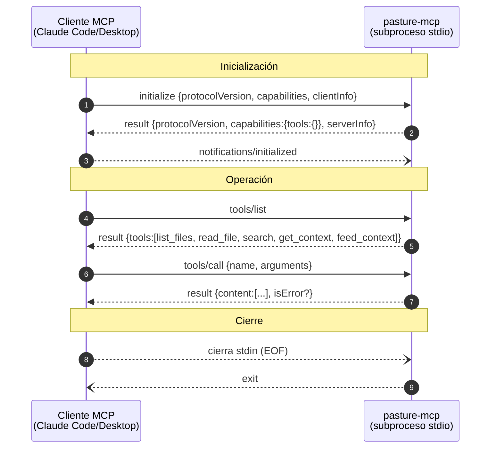

# Spike: Servidor MCP para `~/.pasture/` (`pasture-mcp`)

- **Estado del spike:** Cerrado — recomendación emitida.
- **Fecha:** 2026-06-12.
- **Tipo:** `/alfred spike` (investigación + PoC, sin compromiso de implementación).
- **Autor del diseño:** El Dibujante de Cajas (architect).
- **PoC:** senior-dev — `/tmp/pasture-mcp-spike` (143 LOC + 13 de `Package.swift`).
- **Versión spec MCP de referencia:** `2025-06-18`.
- **Apuesta evaluada:** cuarto target SPM (executable) que exponga el vault `~/.pasture/`
  vía JSON-RPC sobre stdio, sin SDK externo, para convertir Pasture de "app de portapapeles"
  en **hub de contexto** legible por Claude Code / Claude Desktop.

---

## 0. Resumen ejecutivo

El spike confirma que `pasture-mcp` es **viable, barato y estratégicamente alineado**. El
subconjunto de la spec MCP que necesita un servidor de solo lectura con un puñado de tools
es pequeño y estable (~6 métodos JSON-RPC sobre un transporte delimitado por newline), y los
componentes de dominio ya existen y son públicos en `PastureKit` (`FileLibrary`,
`PathValidator`, `ContextBuilder`, `MDFile`). El PoC demostró el handshake completo, las
tools contra el vault real (68 ficheros `.md`), el rechazo de path traversal y latencias
<10 ms, todo en 143 líneas, Swift 6 strict y **cero dependencias**.

La recomendación es **construirlo a mano** (no usar el SDK Swift oficial, que rompería la
regla identitaria cero-dependencias del proyecto), **empaquetarlo embebido en el `.app`** y
**limitar el alcance a solo lectura sobre una única raíz** (`~/.pasture/`). Estas tres
decisiones se formalizan como ADR-001, ADR-002 y ADR-003, en estado **Propuesto**.

El único riesgo material abierto es de **empaquetado/firma**: el PoC validó el binario suelto
desde `/tmp`, pero **no** un binario embebido en un `.app` sin firmar lanzado por un cliente
MCP (Gatekeeper/quarantine). Ese es el primer punto a despejar en la implementación.

Esfuerzo estimado para la v1.5: **≈ 0,5–0,8 × una iteración v1.4** (ver §6 para la
reconciliación entre la estimación del dev, ~1/3, y mi estimación inicial, 1,5–2×).

---

## 1. Protocolo: subset mínimo para un servidor solo-tools

**Versión vigente: `2025-06-18`.** Es la que el cliente negocia en `initialize`; el servidor
responde con la misma si la soporta, o con otra que soporte. El framing del transporte stdio
es deliberadamente simple y quedó confirmado empíricamente por el PoC:

- El cliente lanza el servidor como **subproceso**. El servidor lee JSON-RPC de `stdin` y
  escribe a `stdout`.
- **Mensajes delimitados por newline (`\n`), UTF-8, sin newlines embebidos.** No hay framing
  por longitud (nada de `Content-Length:` estilo LSP). Una línea = un mensaje.
- `stderr` es libre para logging; el cliente lo captura o ignora.
- **`stdout` es sagrado:** solo mensajes MCP válidos. Cualquier `print()` perdido rompe el
  protocolo.

**Lifecycle (tres fases):**

1. **Initialize** — cliente envía `initialize` (`protocolVersion`, `capabilities`,
   `clientInfo`); servidor responde con `protocolVersion`, sus `capabilities` y `serverInfo`;
   cliente envía la notificación `notifications/initialized`.
2. **Operation** — `tools/list` y `tools/call`.
3. **Shutdown** — **no hay mensaje de shutdown.** El cliente cierra `stdin`; el servidor
   detecta EOF y sale. Si no sale, el cliente envía SIGTERM y luego SIGKILL.

**Subset mínimo a implementar (el corazón del scope):**

| Método | Tipo | Responsabilidad |
|---|---|---|
| `initialize` | request | Responder con `capabilities: { tools: {} }`, `serverInfo`, `protocolVersion`. |
| `notifications/initialized` | notification | Recibir, no-op. |
| `tools/list` | request | Devolver el catálogo de tools con su `inputSchema`. |
| `tools/call` | request | Despachar a la tool concreta y devolver el resultado. |
| `ping` | request | Responder `{}`. |
| (errores JSON-RPC) | — | `-32700` parse, `-32601` method not found, `-32602` invalid params. |

Queda **fuera** toda la mitad compleja de la spec: `resources`, `prompts`, `logging`,
`completions`, `sampling`, `roots`, `elicitation`, Streamable HTTP, sesiones, SSE,
resumability, OAuth. El diagrama de secuencia tiene seis flechas. Cabe en un diagrama; no es
demasiado complejo.

*Leyenda: flechas sólidas = request/response; flechas discontinuas = notificación o señal de
transporte. Un solo nodo de servidor; sin estado de sesión.*

Fuentes: [Transports 2025-06-18](https://modelcontextprotocol.io/specification/2025-06-18/basic/transports),
[Lifecycle 2025-06-18](https://modelcontextprotocol.io/specification/2025-06-18/basic/lifecycle).

---

## 2. ¿SDK oficial o implementación propia?

El [swift-sdk oficial](https://github.com/modelcontextprotocol/swift-sdk) existe, está vivo
(v0.12.1, mayo 2026; 23 releases; Swift 6; soporta `StdioTransport` para servidores) y sobre
el papel encaja. **Pero arrastra dependencias transitivas que rompen la regla identitaria del
proyecto.** Su `Package.swift` declara, en el camino de un servidor stdio:

- `swift-system` (SystemPackage) — target MCP
- `swift-log` (Logging) — target MCP
- `eventsource` (de mattt) — target MCP, plataformas Apple
- `swift-nio` (NIOCore/NIOPosix/NIOHTTP1) — solo en el target de conformance, pero presente
  en el grafo
- `swift-docc-plugin` — build tool

Es decir: adoptar el SDK añade **al menos 3 dependencias transitivas** (swift-system,
swift-log, eventsource) al grafo de PastureKit/Pasture. El `CLAUDE.md` y el README del
proyecto declaran *"Zero external dependencies — everything uses Apple frameworks"*, y el
`Package.swift` actual de tres targets lo cumple (cero `.package`). Romper eso no es una
decisión técnica menor: es un cambio de carácter del proyecto.

### Evaluación de dependencia

- **Paquete:** `modelcontextprotocol/swift-sdk@0.12.1`
- **Peso:** moderado, pero arrastra swift-system + swift-log + eventsource (+ nio en el grafo).
- **Mantenimiento:** activo (23 releases, último mayo 2026). Sano.
- **Licencia:** dual Apache-2.0 / MIT. Compatible.
- **CVEs:** ninguno conocido (no auditado exhaustivamente).
- **Dependencias transitivas:** 3-4 reales en el camino de un servidor stdio. **Este es el
  problema.**
- **Madurez de API:** versión < 1.0; ha roto API recientemente (`Error` → `MCPError`). Riesgo
  de churn.
- **Alternativas:** implementación propia con `Codable` + `FileHandle`.
- **Veredicto:** **RECHAZAR** para este proyecto, mientras la regla cero-dependencias siga
  siendo invariante.

**Contraargumento (¿cuánta spec a mano?):** poca, y estable. Nuestro subset son ~6 métodos
sin estado sobre un transporte trivial. La superficie que evoluciona rápido (Streamable HTTP,
OAuth, resumability) es justo la que **no** tocamos. El núcleo solo-tools/stdio es la parte
más estable de MCP, casi sin cambios de fondo desde 2024-11-05. El riesgo de drift de spec
sobre nuestro subset es bajo. Y los ladrillos ya existen: `SSEParser` demuestra que el equipo
sabe parsear protocolos de líneas a mano, y `FileLibrary`/`PathValidator`/`ContextBuilder`/
`MDFile` cubren la lógica de las tools.

**Decisión preliminar (formalizada en ADR-001): implementación propia.** El PoC la valida:
143 LOC, cero deps, build limpio, handshake y tools funcionando.

Fuentes: [swift-sdk](https://github.com/modelcontextprotocol/swift-sdk),
[Package.swift del SDK](https://raw.githubusercontent.com/modelcontextprotocol/swift-sdk/main/Package.swift),
[SDKs MCP](https://modelcontextprotocol.io/docs/sdk).

---

## 3. Empaquetado y registro

Ambos clientes ejecutan **un binario con argumentos**:

- **Claude Desktop:** `~/Library/Application Support/Claude/claude_desktop_config.json`,
  bloque `mcpServers` con `command` + `args`.
- **Claude Code:** `claude mcp add [--scope local|project|user] <name> -- <command> [args...]`
  (el `--` separa las flags de Claude del comando real), o un `.mcp.json` en la raíz del
  proyecto (versionable), o `~/.claude.json`.

El PoC se registró con `claude mcp add` apuntando al binario suelto en `/tmp` y dio
`✔ Connected`. Confirma que el modelo "un binario + args" funciona end-to-end.

### Matriz de decisión: dónde vive el binario

| Criterio | Peso | A) Binario suelto en `dist/` | B) Embebido en el `.app` | C) `swift run pasture-mcp` |
|---|---|---|---|---|
| UX de instalación | 0.30 | 6 | 8 | 3 |
| Robustez de ruta (estable tras updates) | 0.25 | 5 | 7 | 8 |
| Simplicidad de `bundle.sh` | 0.20 | 8 | 6 | 9 |
| Sin requerir toolchain en runtime | 0.15 | 9 | 9 | 2 |
| Descubribilidad | 0.10 | 4 | 8 | 3 |
| **TOTAL PONDERADO** | | **6.25** | **7.45** | **4.85** |

- **C (`swift run`)** descartada: exige toolchain Swift en la máquina del usuario en cada
  arranque, recompila y arranca lento. Inaceptable para un binario lanzado repetidamente.
- **B (embebido en el `.app`)** gana. El binario vive en
  `Pasture.app/Contents/MacOS/pasture-mcp`. Ventaja gorda de UX: la app puede ofrecer un botón
  *"Copiar configuración MCP"* que genere el JSON con la ruta absoluta correcta al binario
  dentro del bundle instalado. `bundle.sh` solo necesita copiar un segundo ejecutable (que
  `swift build -c release` ya produce con el cuarto target). El servidor de filesystem oficial
  se registra exactamente así de simple, lo que confirma el patrón.
- **Gotcha de B (riesgo abierto, ver §8):** un cliente MCP lanza el binario **fuera** del
  contexto de la app. Hay que confirmar que un ejecutable dentro de `Contents/MacOS` arranca
  cuando lo invoca otro proceso, en un `.app` que hoy **no se firma**. El PoC no cubrió este
  caso (validó binario suelto desde `/tmp`).

UX realista para el `bundle.sh` actual: añadir la copia del segundo binario (3-4 líneas) y un
generador del snippet de configuración ya rellenado con la ruta del bundle.

Fuentes: [Connect local servers](https://modelcontextprotocol.io/docs/develop/connect-local-servers),
[Claude Code MCP](https://code.claude.com/docs/en/mcp),
[Getting started local MCP (Claude Help)](https://support.claude.com/en/articles/10949351-getting-started-with-local-mcp-servers-on-claude-desktop).

---

## 4. Concurrencia y acceso al vault

El servidor corre como **proceso separado**, lanzado por el cliente MCP, independiente del
proceso de la app (que puede ni estar abierta).

- **Lecturas concurrentes de `~/.pasture/` son inocuas.** Las tools son **solo lectura**. Dos
  procesos leyendo el mismo árbol no se pisan; el FS maneja lectores concurrentes sin bloqueo.
  No hay sección crítica.
- **Sin conflicto con el `DirectoryWatcher` de la app.** El watcher reacciona a *cambios*. El
  servidor MCP no escribe nada, así que **no genera eventos**. Son observadores pasivos del
  mismo árbol; ninguno produce efectos para el otro. El único escritor sigue siendo el editor
  externo del usuario, como hoy.
- **Solo lectura elimina por diseño el problema de escrituras concurrentes.** No hay locking,
  ni coordinación entre procesos, ni riesgo de corrupción. Esta es la razón arquitectónica más
  fuerte para mantener el scope solo-lectura en v1.5: convierte un problema espinoso (dos
  procesos escribiendo el vault) en un no-problema. La app escribe; el servidor lee. Separación
  de responsabilidades.
- **Riesgo menor:** un fichero a medio escribir por el editor podría leerse parcial. Riesgo
  mínimo y transitorio, idéntico al que ya asume la app. No justifica locking.

El PoC confirmó indirectamente la benignidad: 3 round-trips contra el vault real (68 ficheros),
latencia <10 ms incluido arranque, sin contención.

---

## 5. Seguridad

Superficie nueva: **un proceso local que expone el contenido curado de `~/.pasture/` a
cualquier cliente MCP que el usuario configure.**

- **¿Autenticación en stdio? No, y es correcto.** El modelo de confianza de stdio es: *el
  cliente lanza el proceso*. No hay socket, ni puerto, ni conexiones entrantes; solo habla con
  el proceso padre vía stdin/stdout heredados. Quien puede lanzar el binario ya tiene acceso al
  FS del usuario. Añadir auth a stdio sería teatro de seguridad. La spec solo exige validar
  `Origin` y autenticar en Streamable HTTP, que no usamos.
- **Reutilización de `PathValidator`: imprescindible y disponible.** `read_file` y
  `get_context(collection)` reciben parámetros del cliente (potencialmente un LLM que alucina
  rutas). Cada ruta pasa por `PathValidator.isInside(target:base:)` con base `~/.pasture/`
  **antes de cualquier I/O**. **El PoC lo demostró:** `../.zshrc` y `../../../../etc/passwd`
  fueron rechazados con `isError: true` (lógica de PathValidator copiada).
- **Filtrado de symlinks:** mantener `FileLibrary.realSubdirectories`/`mdFiles`, que ya
  excluyen symlinks, para evitar escapes del vault.
- **`search` acotado:** búsqueda literal o con límites de iteración/coste (en la línea del cap
  de 1.000 iteraciones de `TemplateEngine`), para evitar ReDoS o lectura masiva.
- **Output injection:** las respuestas van a un LLM; `ContextBuilder` ya envuelve en CDATA y
  escapa el cierre `]]>`. Reutilizarlo en `get_context`/`feed_context`.
- **Una sola raíz fija** (`~/.pasture/`) es **más restrictivo que el server-filesystem
  genérico**, que puede apuntar a cualquier carpeta. Menos superficie por diseño.

**Riesgo residual no técnico:** si el usuario guarda secretos en `~/.pasture/` (no es su
propósito), cualquier cliente MCP los leería. Mitigación: documentar que el vault es contexto
compartible, no un almacén de secretos.

**Hallazgo de seguridad:** no se identifica vector crítico nuevo siempre que se cumplan (a)
toda ruta por `PathValidator`, (b) filtrado de symlinks, (c) `search` acotado, (d) documentar
que el vault no es para secretos. **Pendiente:** firma del security-officer en la fase de
diseño de implementación.

Fuentes: [filesystem server README](https://github.com/modelcontextprotocol/servers/blob/main/src/filesystem/README.md),
[Transports — security warning](https://modelcontextprotocol.io/specification/2025-06-18/basic/transports).

---

## 6. Esfuerzo: reconciliación de estimaciones

Dos cifras sobre la mesa:

- **Estimación inicial del architect (fase 1):** ≈ 1,5–2 × v1.4.
- **Estimación del senior-dev tras el PoC:** ≈ 1/3 de v1.4.

No se contradicen: **miden cosas distintas.** Reconciliación:

| Bloque | Esfuerzo (× v1.4) | Cubierto por el PoC | Notas |
|---|---|---|---|
| Capa protocolo (JSON-RPC Codable, loop stdin/stdout, initialize/initialized/ping, errores) | ~0.15 | **Sí** | 143 LOC ya demuestran el núcleo funcionando. |
| Las tools (schemas + despacho a PastureKit) | ~0.10 | **Sí** (4 tools) | Lógica de dominio casi gratis: FileLibrary/PathValidator/ContextBuilder públicos. |
| Tool extra `feed_context` (propuesta del dev) | ~0.05 | Parcial | Reutiliza ContextBuilder; es el Feed de Pasture como tool estrella. |
| **Subtotal "lo que midió el dev"** | **~0.30** | | Coincide con su "1/3 de v1.4". |
| Empaquetado (4º target, copia en `bundle.sh`) | ~0.10 | No | Trivial en sí. |
| Generador de config en la app + UX de registro | ~0.10 | No | Botón "Copiar configuración MCP". |
| Resolver Gatekeeper/firma del `.app` | ~0.05–0.20 | **No** | **Incógnita.** Si exige firma/notarización, sube. |
| Tests (framing, despacho, rechazo de traversal, golden de respuestas) | ~0.15 | Base copiada | Cultura de test del proyecto (327 tests). |
| **TOTAL reconciliado** | **≈ 0,5–0,8 × v1.4** | | El rango lo marca el riesgo Gatekeeper. |

**Conclusión:** la estimación del dev (~1/3) es correcta **para el código del servidor en sí**,
que es lo que el PoC midió. Mi estimación inicial (1,5–2×) era conservadora y abarcaba
empaquetado + UX + tests + el riesgo Gatekeeper que el PoC todavía no despejó. Con el PoC en la
mano, el rango realista para **toda** la feature de v1.5 es **0,5–0,8 × una iteración v1.4**, y
el extremo alto depende casi por completo de cuánto cueste el empaquetado firmado. Es una
feature pequeña, con la mayor incertidumbre concentrada fuera del código de protocolo.

---

## 7. Alternativas consideradas

| Criterio | Peso | A) Target executable propio (a mano) | B) MCP dentro de la app (mismo proceso) | C) Apuntar a server-filesystem genérico | D) No hacer nada |
|---|---|---|---|---|---|
| Encaja regla cero-deps | 0.20 | 9 | 9 | 10 | 10 |
| UX de instalación | 0.15 | 7 | 5 | 6 | — |
| Diferenciación ("hub de contexto") | 0.20 | 9 | 8 | 2 | 1 |
| Control sobre tools/formato | 0.15 | 9 | 9 | 3 | 1 |
| Independencia del estado de la app | 0.15 | 9 | 2 | 8 | — |
| Esfuerzo (inverso) | 0.10 | 6 | 5 | 9 | 10 |
| Seguridad / superficie | 0.05 | 8 | 6 | 5 | 10 |
| **TOTAL PONDERADO** | | **8.30** | **6.75** | **5.30** | ~3.4 |

- **B (MCP dentro de la app)** falla en lo decisivo: un cliente MCP necesita lanzar un proceso
  que hable stdio. Si el MCP vive dentro de la app SwiftUI, o la app debe estar siempre
  corriendo y exponer stdio (no encaja con una app de menu bar que se abre y cierra), o hay que
  arrancar la GUI entera para servir tools de texto. Acopla el ciclo de vida del servidor al de
  la GUI. Mal trade-off.
- **C (server-filesystem genérico)** es barato (cero código) pero regala toda la diferenciación:
  sin `get_context(collection)` ni `feed_context` con el formato XML/CDATA curado de Pasture,
  sin tokenización, sin semántica de colecciones. Pasture quedaría como "una carpeta más".
  Además exige Node/npx. Sirve, como mucho, de fallback documentado.
- **A (target propio a mano)** gana con holgura y es lo que el PoC validó. Respeta cero-deps,
  vive independiente de la app, da control total sobre el formato de contexto (el valor de
  Pasture) y reutiliza PastureKit.
- **D (no hacer nada)** es el suelo. El patrón "vault expuesto por MCP" domina el espacio
  (mcp-obsidian 3.9k⭐, basic-memory 3.2k⭐) y **ningún competidor nativo macOS lo tiene**. No
  moverse cede ese hueco.

---

## 8. Resultados del PoC y riesgos abiertos

### Lo que el PoC demostró (`/tmp/pasture-mcp-spike`)

- **143 LOC reales + 13 de `Package.swift`.** Swift 6 strict concurrency, **cero
  dependencias**, build limpio.
- **Handshake completo:** `initialize` + `tools/list` + `tools/call` funcionando contra
  `~/.pasture/` real (68 ficheros `.md`).
- **Registro real:** `claude mcp add` → `✔ Connected` (binario suelto desde `/tmp`).
- **Seguridad validada:** `../.zshrc` y `../../../../etc/passwd` rechazados con `isError: true`
  (lógica de PathValidator copiada).
- **Rendimiento:** latencia <10 ms en 3 round-trips, incluido el arranque.
- **Propuesta del dev:** una tool extra `feed_context` (el Feed de Pasture vía
  `ContextBuilder`) como **tool estrella** — entrega no un fichero crudo, sino el contexto
  ensamblado y envuelto que ya produce la app.

### Gotchas empíricos (para la implementación real)

1. **Framing newline-delimited**, no `Content-Length` (no es LSP).
2. **`stdout` sagrado:** todo log va a `stderr`.
3. **`capabilities.tools` debe estar presente** en la respuesta de `initialize`, aunque sea
   `{}`.
4. **`inputSchema` obligatorio** en cada tool, con `type: "object"`.
5. **Las notificaciones se detectan por ausencia de `id`** (no se responden).
6. **`isError: true` vive en `result`** (error de tool, lo ve el modelo) frente al objeto
   `error` de JSON-RPC (error de protocolo). No confundirlos.
7. **`JSONSerialization` escapa `/` como `\/`.** Usar `Codable` + `JSONEncoder` en la versión
   real para un output limpio.

### Riesgos abiertos

| # | Riesgo | Severidad | Estado | Mitigación / siguiente paso |
|---|---|---|---|---|
| R1 | **Gatekeeper/firma:** binario embebido en `.app` sin firmar, lanzado por otro proceso. El PoC validó binario suelto desde `/tmp`, **no** este caso. | **Alta** | **Abierto** | Primer experimento de la implementación: bundle real + `claude mcp add` apuntando dentro del `.app` instalado en `/Applications`. Evaluar si exige firma/notarización ad-hoc. |
| R2 | Generador de config / UX de registro no prototipado. | Media | Abierto | Diseñar botón "Copiar configuración MCP" con ruta absoluta del binario en el bundle. |
| R3 | Firma del security-officer pendiente sobre el diseño completo. | Media | Abierto | Revisión en paralelo en la fase de diseño de implementación. |
| R4 | Drift de spec MCP (sube de versión). | Baja | Aceptado | Subset estable; negociar versión en `initialize`. |
| R5 | `search` sin límites → ReDoS / lectura masiva. | Baja | Abierto | Búsqueda literal o acotada por iteración/coste. |

---

## 9. Recomendación final

**Construir `pasture-mcp` en la v1.5**, con el siguiente alcance propuesto:

- **Cuarto target SPM executable** (`pasture-mcp`), implementación propia con `Codable` +
  `FileHandle`, **cero dependencias externas**.
- **Subset MCP solo-tools sobre stdio:** `initialize`, `notifications/initialized`,
  `tools/list`, `tools/call`, `ping`, manejo de errores JSON-RPC. Versión spec `2025-06-18`.
- **Tools de solo lectura sobre la única raíz `~/.pasture/`:**
  - `list_files` — lista de ficheros (vía `FileLibrary`).
  - `read_file` — contenido de un fichero (ruta validada por `PathValidator`).
  - `search` — búsqueda acotada en el vault.
  - `get_context(collection)` — contexto de una colección, envuelto por `ContextBuilder`.
  - `feed_context` *(tool estrella, propuesta del dev)* — el Feed de Pasture ensamblado vía
    `ContextBuilder`.
- **Empaquetado embebido en el `.app`** (`Contents/MacOS/pasture-mcp`), con un generador de
  configuración en la app para el registro en Claude Code / Desktop.
- **Reutilización de PastureKit** (`FileLibrary`, `PathValidator`, `ContextBuilder`, `MDFile`)
  como única fuente de lógica de dominio.

**Condición de arranque de la implementación:** el primer experimento debe ser el end-to-end
del **binario embebido en el `.app` instalado** lanzado por un cliente MCP (riesgo R1). Si ahí
aparece fricción de firma, se decide entre firma ad-hoc, notarización o documentar un paso
manual de "quitar quarantine" — antes de invertir en el resto.

---

## ADR-001: Implementación propia del servidor MCP (sin SDK externo)

- **Estado:** Propuesto.
- **Fecha:** 2026-06-12.

### Contexto

Pasture exige **cero dependencias externas** (restricción identitaria, declarada en `CLAUDE.md`
y README, verificable en el `Package.swift` de tres targets sin `.package`). Para exponer
`~/.pasture/` vía MCP existe un SDK Swift oficial, pero hay que decidir si adoptarlo o
implementar el subset a mano.

### Opciones consideradas

**Opción A — SDK oficial `modelcontextprotocol/swift-sdk`.**
- Pros: implementación de referencia, mantenida (v0.12.1, mayo 2026), cubre toda la spec,
  `StdioTransport` listo.
- Contras: arrastra ≥3 dependencias transitivas (swift-system, swift-log, eventsource; nio en
  el grafo) → **rompe la regla cero-deps**; versión <1.0 con API que ya ha roto
  (`Error`→`MCPError`); resuelve sobre todo la parte HTTP que no usamos.

**Opción B — Implementación propia (`Codable` + `FileHandle`).**
- Pros: cero dependencias; control total; subset pequeño (~6 métodos) y estable; reutiliza
  patrones existentes (`SSEParser`) y dominio (`FileLibrary`/`PathValidator`/`ContextBuilder`).
- Contras: hay que escribir y testear el framing y el lifecycle a mano; responsabilidad propia
  ante cambios de spec.

### Decisión

**Implementación propia (Opción B).** El subset solo-tools/stdio es la parte más estable de
MCP y pequeño en superficie; el coste de romper la regla cero-deps es identitario, no solo
técnico, y supera el ahorro de un SDK orientado mayormente a HTTP. **El PoC lo confirma:** 143
LOC, cero deps, build limpio, handshake y tools funcionando, traversals rechazados.

### Consecuencias

- **Ganamos:** se preserva la regla cero-deps; control total del formato; binario mínimo y
  rápido (<10 ms); base de tests propia y simple (input línea → output línea).
- **Perdemos / deuda:** responsabilidad de seguir la spec a mano si evoluciona (mitigado: el
  subset es estable y se negocia versión en `initialize`); reimplementar utilidades que el SDK
  daría hechas.

---

## ADR-002: Empaquetado del binario embebido en el `.app`

- **Estado:** Propuesto.
- **Fecha:** 2026-06-12.

### Contexto

Los clientes MCP (Claude Code / Desktop) lanzan el servidor como subproceso vía `command` +
`args`. Hay que decidir dónde vive el binario `pasture-mcp` y cómo lo registra el usuario, de
forma compatible con el `bundle.sh` actual (que hoy empaqueta un único ejecutable en
`Pasture.app/Contents/MacOS/`).

### Opciones consideradas

**Opción A — Binario suelto en `dist/`.** Pros: simple en `bundle.sh`; no requiere toolchain en
runtime. Contras: ruta frágil (el usuario lo mueve); poco descubrible; UX de instalación
mediocre. *(Matriz: 6.25.)*

**Opción B — Embebido en el `.app`** (`Contents/MacOS/pasture-mcp`). Pros: ruta estable mientras
la app esté instalada; la app puede generar el snippet de config con la ruta correcta;
descubrible; sin toolchain en runtime; `bundle.sh` solo copia un segundo binario. Contras:
binario lanzado por otro proceso en un `.app` sin firmar → **riesgo Gatekeeper/quarantine no
validado por el PoC**. *(Matriz: 7.45.)*

**Opción C — `swift run pasture-mcp`.** Pros: trivial en `bundle.sh`. Contras: exige toolchain
Swift en runtime; recompila; arranque lento. Inaceptable. *(Matriz: 4.85.)*

### Decisión

**Embebido en el `.app` (Opción B)**, con un generador de configuración en la propia app
(botón "Copiar configuración MCP"). Es la mejor UX de instalación y la ruta más estable, y
sigue el patrón del server-filesystem oficial ("un binario + args").

### Consecuencias

- **Ganamos:** ruta estable; registro casi sin fricción para el usuario; `bundle.sh` cambia
  poco (copia de un binario + generación del snippet).
- **Perdemos / deuda / riesgo abierto:** **R1 — validar Gatekeeper.** Un `.app` sin firmar
  cuyo binario embebido es lanzado por otro proceso puede toparse con quarantine en la primera
  ejecución. **Primer experimento obligatorio de la implementación.** Si exige firma, se
  decidirá entre firma ad-hoc, notarización o un paso manual documentado. Esta decisión podrá
  obligar a revisar ADR-002 (nuevo ADR que lo referencie) si la vía elegida cambia el modelo de
  empaquetado.

---

## ADR-003: Alcance solo-lectura sobre una única raíz (`~/.pasture/`)

- **Estado:** Propuesto.
- **Fecha:** 2026-06-12.

### Contexto

Un servidor MCP que expone el vault podría ofrecer tools de lectura **y** escritura, y/o operar
sobre múltiples directorios (como el server-filesystem genérico, configurable por args/roots).
Hay que fijar el alcance de la v1.5 equilibrando valor, complejidad, concurrencia y seguridad.

### Opciones consideradas

**Opción A — Solo lectura, raíz única `~/.pasture/`.**
- Pros: concurrencia benigna por diseño (no hay escrituras → no choca con el `DirectoryWatcher`
  ni con el editor externo; no hace falta locking); superficie de seguridad mínima (una sola
  raíz, más restrictiva que el server genérico); encaja con el modelo "la app escribe, el
  servidor lee".
- Contras: no permite que el cliente MCP cree/edite ficheros del vault.

**Opción B — Lectura + escritura, raíz única.**
- Pros: el cliente podría curar el vault directamente.
- Contras: **dos procesos escribiendo `~/.pasture/`** (app + servidor) → coordinación, locking,
  riesgo de corrupción y de eventos en cascada con el `DirectoryWatcher`. Mucha complejidad
  para v1.5.

**Opción C — Multi-raíz configurable (estilo server-filesystem).**
- Pros: flexible.
- Contras: amplía la superficie de seguridad (cualquier carpeta); diluye la identidad de
  Pasture como hub de **su** contexto curado; innecesario para el objetivo.

### Decisión

**Solo lectura sobre la única raíz `~/.pasture/` (Opción A).** Tools: `list_files`, `read_file`,
`search`, `get_context(collection)` y `feed_context`. La restricción solo-lectura no es una
limitación accidental: es lo que convierte la concurrencia en un no-problema y acota la
seguridad. **El PoC valida el modelo de lectura y el rechazo de traversal.**

### Consecuencias

- **Ganamos:** cero coordinación entre procesos; sin locking; superficie de seguridad mínima
  (raíz única + `PathValidator` + filtrado de symlinks); separación de responsabilidades nítida
  (app = escritura, servidor = lectura).
- **Perdemos / deuda:** la escritura desde el cliente MCP queda fuera del alcance; si en el
  futuro se quisiera, requerirá un ADR nuevo que aborde el locking entre procesos y la
  interacción con el `DirectoryWatcher`.

---

## Fuentes

- [MCP Transports 2025-06-18](https://modelcontextprotocol.io/specification/2025-06-18/basic/transports)
- [MCP Lifecycle 2025-06-18](https://modelcontextprotocol.io/specification/2025-06-18/basic/lifecycle)
- [swift-sdk oficial](https://github.com/modelcontextprotocol/swift-sdk) · [su Package.swift](https://raw.githubusercontent.com/modelcontextprotocol/swift-sdk/main/Package.swift)
- [SDKs MCP](https://modelcontextprotocol.io/docs/sdk)
- [Connect local servers](https://modelcontextprotocol.io/docs/develop/connect-local-servers)
- [Claude Code MCP](https://code.claude.com/docs/en/mcp)
- [Getting started con MCP local (Claude Help)](https://support.claude.com/en/articles/10949351-getting-started-with-local-mcp-servers-on-claude-desktop)
- [filesystem server (modelcontextprotocol/servers)](https://github.com/modelcontextprotocol/servers/blob/main/src/filesystem/README.md)
- PoC del senior-dev: `/tmp/pasture-mcp-spike` (143 LOC, Swift 6, cero deps).
